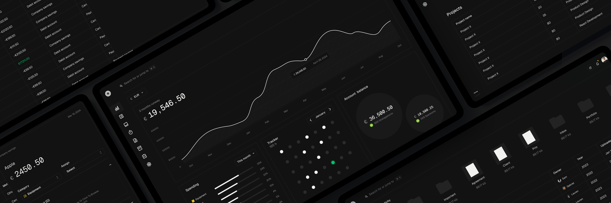
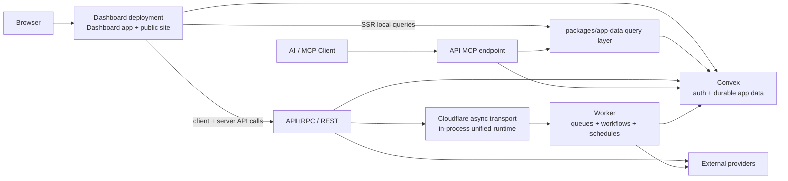

# Tamias



Tamias is a Bun workspaces monorepo for the product workspace, API, Cloudflare async worker runtime, public website, integrations, and shared packages behind invoicing, banking, inbox capture, time tracking, reporting, AI workflows, and UK compliance support.

> Naming note
> The public brand is `Tamias`, but much of the codebase still uses older `tamias` identifiers, package names, env vars, and URLs.

## What lives here

| Surface | Directory | Local URL | What it does |
| --- | --- | --- | --- |
| Dashboard | `dashboard` | `http://localhost:3001` | Main authenticated app, public invoice/customer/report links, auth, SSR, client providers, lightweight public homepage |
| API | `api` | `http://localhost:3003` | Hono API on Cloudflare Workers with tRPC, REST, OpenAPI, MCP, webhooks, health/readiness endpoints |
| Worker | `worker` | `http://127.0.0.1:8787` | Cloudflare async worker with queues, workflows, recurring schedules, notifications, and document processing |
| Website | `dashboard` | `https://tamias.xyz` | Marketing site, integrations catalog, comparison pages, and MCP install guides served from the dashboard deployment |
| Convex | `dashboard/convex` | external local deployment | Durable app data, auth/identity sync, chat memory, widgets, links, files, operational state |

## Product areas

The current codebase covers these main product surfaces:

- Overview widgets and business health metrics
- Transactions, bank connections, CSV/manual import, categorization, review, and export
- Inbox capture from email and messaging sources with document matching
- Invoicing, products, recurring invoices, public invoice links, and Stripe-based payments
- Time tracking with projects, timers, and exports
- Customers, customer portal access, and customer-level analytics
- Vault/files and file-linked workflows
- Apps/integrations, API keys, developer settings, and OAuth applications
- AI chat, suggested actions, weekly insights, and MCP-based developer/agent access
- UK compliance with VAT filing, Companies House XML annual-accounts filing, year-end packs and corporation-tax prep with HMRC CT Transaction Engine support, and payroll import/export workflows

## Architecture

### Runtime overview



### Request and data flow

1. Requests into the dashboard deployment run request middleware from `dashboard/src/start/start.ts` (`createStart` + `createMiddleware`).
   Host-aware routing and authenticated route gating happen there.
2. The dashboard root layout mounts Convex auth, tRPC, i18n, theming, analytics, and shared client providers.
3. The authenticated sidebar shell preloads the current user/team and mounts global chrome like the sidebar, header, timers, sheets, and export status.
4. Hot server-rendered reads use route loaders backed by `dashboard/src/start/server/route-data/*` (for example `dashboard.ts`, `transactions.ts`), which call tRPC server helpers and the shared query layer instead of round-tripping through HTTP for every SSR request.
5. Client mutations and most interactive reads go through tRPC to `api`.
6. The API exposes:
   - tRPC for first-party app calls
   - REST routes for files, invoices, customers, chat, insights, webhooks, transcription, and integrations
   - OpenAPI + Scalar docs
   - MCP tools/resources/prompts for agent clients
7. Long-running work is enqueued through Cloudflare queues/workflows and processed by `worker`.
8. Convex remains the durable store for auth-linked app state, public links, files metadata, widgets, suggestions, chat memory, and async run status records.

### Data model and boundaries

- `dashboard/convex` contains the durable model for users, teams, customers, documents, inbox, invoices, tracker data, links, widgets, insights state, tags, transaction metadata, and more.
- `packages/app-data` is the shared application data layer used by the dashboard, API, and worker.
- Cloudflare queues/workflows provide the async execution plane. Durable product state does not live in the worker runtime.
- Convex `asyncRuns` records are the durable source of truth for async status across dashboard, API, and worker flows.

## Feature map

| Area | Main routes / entry points | Backing packages and services |
| --- | --- | --- |
| Overview and widgets | `/dashboard` | `api/src/trpc/routers/widgets.ts`, `dashboard/convex/widgets.ts`, `packages/insights` |
| Transactions and banking | `/transactions`, `/settings/accounts` | `packages/banking`, `packages/import`, `packages/categories`, transaction/banking routers, worker transaction processors |
| Inbox and document capture | `/inbox`, `/inbox/settings` | `packages/inbox`, `packages/documents`, inbox/document workers, Gmail/Outlook/Slack/WhatsApp integrations |
| Invoicing and payments | `/invoices`, `/invoices/products`, public `/i/<token>` | `packages/invoice`, invoice/payment routers, Stripe and Stripe Payments integrations |
| Time tracking | `/tracker` | tracker project/entry routers, export flows, Raycast and MCP integrations |
| Customers and portal | `/customers`, public `/p/<portalId>` | customer analytics, `worker/src/customers`, enrichment jobs |
| Vault and files | `/vault`, file download/proxy routes | `packages/storage`, file routes, document processing |
| Reports and public links | `/dashboard`, public `/r/<linkId>` and `/s/<shortId>` | reports routers, short links, report links in Convex |
| AI assistant and insights | `/chat/[id]`, insight notifications/audio | `api/src/ai`, `packages/insights`, MCP server/tools, suggested actions |
| Compliance | `/compliance`, `/compliance/vat`, `/compliance/settings`, `/compliance/year-end`, `/compliance/payroll` | `packages/compliance`, HMRC VAT integration, year-end packs, payroll runs, evidence/export bundles |
| Apps and developer tooling | `/apps`, `/settings/developer` | `packages/app-store`, OAuth applications, API keys, MCP, public integrations catalog |

## Tech stack

### Core platform

- Bun runtime and package manager
- Bun workspaces (`dashboard`, `api`, `worker`, `packages/*`)
- TypeScript across apps and packages
- Biome for linting/formatting

### Frontend

- TanStack Start in `dashboard`
- React 19
- Vite build/dev pipeline
- Shared UI primitives in `packages/ui`
- TanStack Router, TanStack Query, and tRPC client
- Convex auth/client integration
- Playwright for dashboard end-to-end tests

### Backend and async

- Hono on Cloudflare Workers for the API surface
- tRPC for first-party app APIs
- OpenAPI via `@hono/zod-openapi` and Scalar docs
- Model Context Protocol server in `api/src/mcp`
- Cloudflare Queues, Workflows, Cron Triggers, Durable Objects, and Containers in `worker`

### Data and domain packages

- Convex for durable app data, auth-linked state, files, and async run tracking
- `packages/app-data` as the shared app-data layer
- `packages/accounting`, `packages/banking`, `packages/compliance`, `packages/documents`, `packages/inbox`, `packages/invoice`, `packages/insights`, `packages/storage`

### AI and external services

- AI SDK with OpenAI, Google, Anthropic, and Mistral providers in different flows
- ElevenLabs for optional insight audio
- Exa and Plain in supporting flows
- Plaid, GoCardless, and Teller for banking
- Xero, QuickBooks, and Fortnox for accounting exports/sync
- Companies House OAuth, filing transaction, and public-register readiness integration groundwork
- Stripe and Polar for payments/billing
- Resend, Slack, Gmail, Outlook, and WhatsApp integrations

## Shared package map

These are the packages you will touch most often:

- `packages/accounting`: accounting-provider adapters and export helpers
- `packages/app-store`: integration catalog, MCP client definitions, app metadata
- `packages/banking`: bank-provider adapters and normalization
- `packages/categories`: transaction categories and tax-rate helpers
- `packages/compliance`: UK compliance domain logic and HMRC VAT helpers
- `packages/app-data`: shared app-data and domain query surface
- `packages/documents`: document loading, classification, embedding, extraction helpers
- `packages/encryption`: OAuth state encryption, file keys, shared crypto helpers
- `packages/inbox`: inbox connectors and provider integrations
- `packages/insights`: metrics, summaries, audio, and insight content generation
- `packages/invoice`: invoice rendering, templates, recurring logic, public invoice support
- `packages/job-client`: async client used by API/dashboard/worker to enqueue Cloudflare jobs, workflows, and recurring schedules
- `packages/notifications`: email and in-app notification logic
- `packages/plans`: billing plan metadata
- `packages/storage`: Convex-backed storage helpers
- `packages/trpc`: shared tRPC helpers and internal client
- `packages/ui`: shared UI components, icons, globals, animations
- `packages/utils`: environment helpers and cross-cutting utilities

App-owned modules that are no longer shared packages:

- `api/src/health`: dependency probes and readiness helpers
- `dashboard/src/lib/telemetry`: telemetry client/server wrappers
- `worker/src/customers`: customer enrichment pipeline

## Local development

### Prerequisites

- Bun `1.3.x`

### Install

```bash
bun install
```

### Env files

Create **`dashboard/.env.local`**, **`api/.env`**, and **`worker/.env`** (and for `wrangler dev` on the API, **`api/.dev.vars`** with secrets Wrangler injects). Use the checklist below for variables and alignment across services.

### Minimum env checklist

Make sure these values exist and line up across services.

#### Dashboard

```dotenv
DASHBOARD_URL=http://localhost:3001
WEBSITE_URL=http://localhost:3000
API_URL=https://api.tamias.xyz

CONVEX_URL=https://fleet-chameleon-251.eu-west-1.convex.cloud
CONVEX_SITE_URL=https://fleet-chameleon-251.eu-west-1.convex.site

INTERNAL_API_KEY=...
INVOICE_JWT_SECRET=...
FILE_KEY_SECRET=...
```

#### API

```dotenv
ALLOWED_API_ORIGINS=http://localhost:3001
TAMIAS_DASHBOARD_URL=http://localhost:3001
TAMIAS_API_URL=http://localhost:3003

CONVEX_URL=https://fleet-chameleon-251.eu-west-1.convex.cloud
CONVEX_SITE_URL=https://fleet-chameleon-251.eu-west-1.convex.site
CONVEX_SERVICE_KEY=...

CLOUDFLARE_ASYNC_BRIDGE_URL=http://127.0.0.1:8787
CLOUDFLARE_ASYNC_BRIDGE_TOKEN=...

INTERNAL_API_KEY=...
INVOICE_JWT_SECRET=...
FILE_KEY_SECRET=...
TAMIAS_ENCRYPTION_KEY=<64-char hex string>

COMPANIES_HOUSE_CLIENT_ID=...
COMPANIES_HOUSE_CLIENT_SECRET=...
COMPANIES_HOUSE_OAUTH_REDIRECT_URL=http://localhost:3003/apps/companies-house/oauth-callback
COMPANIES_HOUSE_ENVIRONMENT=sandbox
COMPANIES_HOUSE_API_KEY=...
COMPANIES_HOUSE_XML_ENVIRONMENT=test
COMPANIES_HOUSE_XML_PRESENTER_ID=...
COMPANIES_HOUSE_XML_PRESENTER_AUTHENTICATION_CODE=...
# Optional in test mode; defaults to OPSLDG
COMPANIES_HOUSE_XML_PACKAGE_REFERENCE=...

HMRC_CT_ENVIRONMENT=test
HMRC_CT_SENDER_ID=...
HMRC_CT_SENDER_PASSWORD=...
HMRC_CT_VENDOR_ID=...
HMRC_CT_TEST_UTR=...
HMRC_CT_PRODUCT_NAME=Tamias
HMRC_CT_PRODUCT_VERSION=0.1.0
```

#### Worker

```dotenv
CONVEX_URL=https://fleet-chameleon-251.eu-west-1.convex.cloud
CONVEX_SITE_URL=https://fleet-chameleon-251.eu-west-1.convex.site
CONVEX_SERVICE_KEY=...

API_URL=http://localhost:3003
CLOUDFLARE_ASYNC_BRIDGE_TOKEN=...
INTERNAL_API_KEY=...
INVOICE_JWT_SECRET=...
```

#### Important env notes

- `INTERNAL_API_KEY`, `INVOICE_JWT_SECRET`, and `FILE_KEY_SECRET` must match everywhere they are used.
- Public site features run inside `dashboard`, so site env values should be configured there.
- `HMRC_CT_ENVIRONMENT` defaults to `test`. Keep it there in deployed environments until you intentionally want live HMRC CT filing.
- In `test`, CT submissions use `HMRC_CT_TEST_UTR` when present. In `production`, the filing profile UTR is required.
- Companies House annual accounts filing uses the XML gateway presenter runtime on the API service; it does not use the OAuth app credentials.

### UK Filing Runtime

The current UK filing paths split by authority and transport:

- `HMRC VAT`: live OAuth/API submission flow.
- `HMRC corporation tax`: CT600/iXBRL generation plus Transaction Engine submit/poll. Runtime is switchable between `test` and `production`, but should stay on `test` by default until you have live sender credentials and a real company UTR.
- `Companies House annual accounts`: XML gateway submission from the year-end workspace using presenter credentials and the company authentication code saved in compliance settings.

Key operator docs:

- `docs/uk-compliance.md`
- `docs/year-end-operations.md`
- `docs/companies-house-filing.md`

### Start the stack

Recommended main app startup:

```bash
bun run dev:local
```

That starts the local dashboard on `http://localhost:3001` against the shared deployed backend:

- deployed unified API at `https://api.tamias.xyz` (served by the same `tamias` worker)
- shared Convex deployment at `fleet-chameleon-251`

There is no separate local Convex instance anymore.

### Separate terminal startup

```bash
bun run dev:dashboard
```
The current local setup uses the unified worker path in `dashboard`, so separate `api` and `worker` Cloudflare processes are no longer required.

### First login

1. Open `http://localhost:3001/login`
2. Sign in with an existing Tamias account, or create one
3. You will be using the shared deployed Convex data, not a local seeded instance

## Local URLs and surfaces

| Surface | URL |
| --- | --- |
| Dashboard | `http://localhost:3001` |
| Dashboard health | `http://localhost:3001/api/health` |
| API | `http://localhost:3001` (routed by path) |
| API health | `http://localhost:3001/health` |
| API readiness | `http://localhost:3001/health/ready` |
| OpenAPI spec | `http://localhost:3001/openapi` |
| Scalar API docs | `http://localhost:3001/` |
| MCP endpoint | `http://localhost:3001/mcp` |
| Public invoice link | `http://localhost:3001/i/<token>` |
| Customer portal | `http://localhost:3001/p/<portalId>` |
| Public report | `http://localhost:3001/r/<linkId>` |
| Short link redirect | `http://localhost:3001/s/<shortId>` |

## Commands

### Root

```bash
bun run dev
bun run dev:local
bun run dev:dashboard
bun run build
bun run test
bun run test:e2e
bun run typecheck
bun run lint
bun run format
```

### Deploy helpers

```bash
bun run deploy:cloudflare:dashboard:production
bun run deploy:cloudflare:dashboard:staging
```

### Cloudflare preflight

```bash
bun run preflight:cloudflare:dashboard
bun run preflight:cloudflare:dashboard:staging
bun run preflight:cloudflare:dashboard:production
bun run preflight:cloudflare:staging
bun run preflight:cloudflare:production
```

## Deployment notes

- `dashboard` is the single Cloudflare deployment target for app, API, and async runtime behavior.
- `dashboard/wrangler.start.jsonc` is the deploy/runtime entrypoint for Cloudflare.
- `dashboard` now serves both `app.tamias.xyz` and `tamias.xyz`; public-site routes are host-rewritten into the internal `/site` tree.
- Dashboard preflight includes the Vite production build and a Wrangler `deploy --dry-run` against the matching `wrangler.start.jsonc`.
- GitHub Actions deploys expect these repository secrets:
  - `CLOUDFLARE_API_TOKEN`
  - `CLOUDFLARE_ACCOUNT_ID`
- `worker` uses a Cloudflare Images binding for image resize and HEIC-to-JPEG conversion inside the Worker runtime.
- Current runtime defaults in code assume:
  - dashboard URLs under `app.tamias.xyz`
  - API URLs under `api.tamias.xyz`
  - website SEO metadata still pointing at `tamias.xyz`
- If you change public domains, update the matching env vars and the website `baseUrl` so generated links, metadata, emails, and public endpoints stay aligned.

## Deeper docs

There is one documentation layer in this repo:

- Deeper engineering notes in `docs`

Current internal docs include:

- `docs/weekly-insights.md`
- `docs/inbox-matching.md`
- `docs/invoice-recurring.md`
- `docs/document-processing.md`
- `docs/uk-compliance.md`
- `docs/year-end-operations.md`
- `docs/payroll-operations.md`

## Troubleshooting

- Dashboard loads but API-backed data fails:
  `API_URL` is wrong, or the API is not running.
- Login/signup fails:
  Convex is not running, or the Convex URLs do not match the active deployment.
- Queue-backed features do nothing:
  the unified async runtime is misconfigured or local bridge fallback vars (`CLOUDFLARE_ASYNC_BRIDGE_URL` / `CLOUDFLARE_ASYNC_BRIDGE_TOKEN`) are wrong.
- Public invoice downloads fail:
  `INVOICE_JWT_SECRET` does not match across services.
- Internal service calls fail:
  `INTERNAL_API_KEY` is missing or mismatched.
- OAuth/integration setup breaks with encryption errors:
  `TAMIAS_ENCRYPTION_KEY` is missing or invalid.
- Compliance pages show disabled states or missing data:
  the team is not GB-scoped, the filing profile is not enabled, or HMRC/app connections and annual pack data have not been configured yet.
