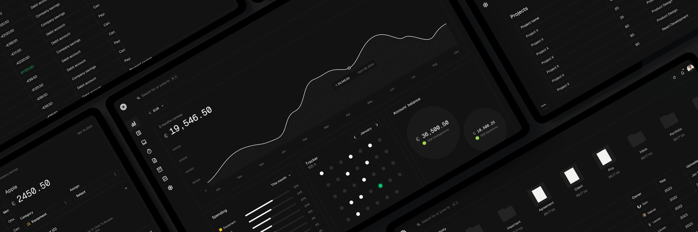
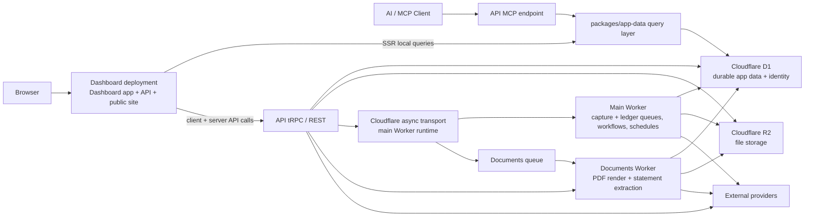

# Tamias



Tamias is a Bun workspaces monorepo for the product workspace, API, Cloudflare async worker runtime, public website, integrations, and shared packages behind invoicing, banking, inbox capture, time tracking, reporting, AI workflows, and UK compliance support.

> Naming note
> The public brand is `Tamias`; package and code identifiers use lowercase `tamias`.

## What lives here

| Surface   | Directory   | Local URL               | What it does                                                                                                           |
| --------- | ----------- | ----------------------- | ---------------------------------------------------------------------------------------------------------------------- |
| Dashboard | `dashboard` | `http://localhost:3001` | Main authenticated app, public invoice/customer/report links, auth, SSR, client providers, lightweight public homepage |
| API       | `api`       | `http://localhost:3001` | Hono API routes bundled into the main Cloudflare Worker with tRPC, REST, OpenAPI, MCP, webhooks, and health checks     |
| Worker    | `worker`    | Cloudflare Workers      | Queue, workflow, recurring schedule, notification, and document/PDF modules split across main and documents Workers    |
| Website   | `dashboard` | `https://tamias.xyz`    | Marketing site, integrations catalog, comparison pages, and MCP install guides served from the dashboard deployment    |

## Product areas

The current codebase covers these main product surfaces:

- Overview widgets and business health metrics
- Transactions, bank connections, CSV/manual import, categorization, review, and export
- Inbox capture from email and messaging sources with document matching
- Invoicing, products, recurring invoices, public invoice links, and Stripe-based payments
- Time tracking with projects, timers, and exports
- Customers, customer portal access, and customer-level analytics
- Vault/files and file-linked workflows
- Apps/integrations, API keys, developer settings, and OAuth applications
- AI chat, suggested actions, weekly insights, and MCP-based developer/agent access
- UK compliance with VAT filing, Companies House XML annual-accounts filing, year-end packs and corporation-tax prep with HMRC CT Transaction Engine support, and payroll import/export workflows

## Architecture

### Runtime overview


```mermaid
flowchart LR
  Browser["Browser"] --> Dashboard["Dashboard deployment<br/>Dashboard app + API + public site"]
  AIClient["AI / MCP Client"] --> MCP["API MCP endpoint"]

  Dashboard -->|SSR local queries| QueryLayer["packages/app-data query layer"]
  Dashboard -->|client + server API calls| TRPC["API tRPC / REST"]

  QueryLayer --> D1["Cloudflare D1<br/>durable app data + identity"]
  TRPC --> D1
  TRPC --> R2["Cloudflare R2<br/>file storage"]
  TRPC --> AsyncRuntime["Cloudflare async transport<br/>main Worker runtime"]
  TRPC --> DocumentsWorker["Documents Worker<br/>PDF render + statement extraction"]
  TRPC --> Providers["External providers"]
  MCP --> QueryLayer

  AsyncRuntime --> Worker["Main Worker<br/>capture + ledger queues, workflows, schedules"]
  AsyncRuntime --> DocumentsQueue["Documents queue"]
  DocumentsQueue --> DocumentsWorker
  Worker --> D1
  Worker --> R2
  DocumentsWorker --> D1
  DocumentsWorker --> R2
  Worker --> Providers
  DocumentsWorker --> Providers
```

### Request and data flow

1. Requests into the dashboard deployment run request middleware from `dashboard/src/start/start.ts` (`createStart` + `createMiddleware`).
   Host-aware routing and authenticated route gating happen there.
2. The dashboard root layout mounts first-party auth, tRPC, i18n, theming, analytics, and shared client providers.
3. The authenticated sidebar shell preloads the current user/team and mounts global chrome like the sidebar, header, timers, sheets, and export status.
4. Hot server-rendered reads use route loaders backed by `dashboard/src/start/server/route-data/*` (for example `dashboard.ts`, `transactions.ts`), which call tRPC server helpers and the shared query layer instead of round-tripping through HTTP for every SSR request.
5. Client mutations and most interactive reads go through tRPC to `api`.
6. The API exposes:
   - tRPC for first-party app calls
   - REST routes for files, invoices, customers, chat, insights, webhooks, transcription, and integrations
   - OpenAPI + Scalar docs
   - MCP tools/resources/prompts for agent clients
7. Long-running work is enqueued through Cloudflare queues/workflows and processed by `worker`.
8. Document processing, invoice PDF rendering, and PDF statement extraction run in the separate documents Worker (`worker/documents.wrangler.jsonc`) via `DOCUMENTS_QUEUE` and the `DOCUMENTS_WORKER` service binding.
9. Durable app state is stored through Cloudflare D1 and file blobs live in R2; async status is coordinated through the shared app-data layer and Cloudflare worker runtime.

### Data model and boundaries

- `packages/app-data` is the shared application data layer used by the dashboard, API, and worker.
- Cloudflare D1 stores users, teams, app state, documents metadata, inbox, invoices, tracker data, links, widgets, insights state, tags, transaction metadata, and async records.
- Cloudflare R2 stores file blobs and generated artifacts.
- Cloudflare queues/workflows provide the async execution plane. Durable product state does not live in the worker runtime.
- The documents queue is a separate physical queue consumed only by the documents Worker; the main Worker can produce document jobs but does not consume them.

## Feature map

| Area                       | Main routes / entry points                                                                              | Backing packages and services                                                                                            |
| -------------------------- | ------------------------------------------------------------------------------------------------------- | ------------------------------------------------------------------------------------------------------------------------ |
| Overview and widgets       | `/dashboard`                                                                                            | `api/src/trpc/routers/widgets.ts`, `packages/insights`                                                                   |
| Transactions and banking   | `/transactions`, `/settings/accounts`                                                                   | `packages/banking`, `packages/import`, `packages/categories`, transaction/banking routers, worker transaction processors |
| Inbox and document capture | `/inbox`, `/inbox/settings`                                                                             | `packages/inbox`, `packages/documents`, inbox/document workers, Gmail/Outlook/Slack/WhatsApp integrations                |
| Invoicing and payments     | `/invoices`, `/invoices/products`, public `/i/<token>`                                                  | `packages/invoice`, invoice/payment routers, Stripe and Stripe Payments integrations                                     |
| Time tracking              | `/tracker`                                                                                              | tracker project/entry routers, export flows, Raycast and MCP integrations                                                |
| Customers and portal       | `/customers`, public `/p/<portalId>`                                                                    | customer analytics, `worker/src/customers`, enrichment jobs                                                              |
| Vault and files            | `/vault`, file download/proxy routes                                                                    | `packages/storage`, file routes, document processing                                                                     |
| Reports and public links   | `/dashboard`, public `/r/<linkId>` and `/s/<shortId>`                                                   | reports routers, short links, report links in `packages/app-data`                                                        |
| AI assistant and insights  | `/chat/[id]`, insight notifications/audio                                                               | `api/src/ai`, `packages/insights`, MCP server/tools, suggested actions                                                   |
| Compliance                 | `/compliance`, `/compliance/vat`, `/compliance/settings`, `/compliance/year-end`, `/compliance/payroll` | `packages/compliance`, HMRC VAT integration, year-end packs, payroll runs, evidence/export bundles                       |
| Apps and developer tooling | `/apps`, `/settings/developer`                                                                          | `packages/app-store`, OAuth applications, API keys, MCP, public integrations catalog                                     |

## Tech stack

### Core platform

- Bun runtime and package manager
- Bun workspaces (`dashboard`, `api`, `worker`, `packages/*`)
- TypeScript across apps and packages
- ESLint and Prettier for linting and formatting (repo root)

### Frontend

- TanStack Start in `dashboard`
- React 19
- Vite build/dev pipeline
- Shared UI primitives in `packages/ui`
- TanStack Router, TanStack Query, and tRPC client
- First-party auth client integration
- Playwright smoke tests in repo-root **`e2e/`** (against the dashboard build)

### Backend and async

- Hono on Cloudflare Workers for the API surface
- tRPC for first-party app APIs
- OpenAPI via `@hono/zod-openapi` and Scalar docs
- Model Context Protocol server in `api/src/mcp`
- Cloudflare Queues, Workflows, Cron Triggers, Durable Objects, and Containers in `worker`

### Data and domain packages

- Cloudflare D1 for durable app data, identity, and async records
- Cloudflare R2 for files and generated artifacts
- `packages/app-data` as the shared app-data layer
- `packages/accounting`, `packages/banking`, `packages/compliance`, `packages/documents`, `packages/inbox`, `packages/invoice`, `packages/insights`, `packages/storage`

### AI and external services

- AI SDK with OpenAI, Google, and Mistral providers in different flows
- ElevenLabs for optional insight audio
- Exa and Plain in supporting flows
- TrueLayer for banking
- QuickBooks and Fortnox for accounting exports/sync
- Companies House OAuth, filing transaction, and public-register readiness integration groundwork
- Stripe and Polar for payments/billing
- Cloudflare Email Service, Slack, Gmail, Outlook, and WhatsApp integrations

## Shared package map

These are the packages you will touch most often:

- `packages/accounting`: accounting-provider adapters and export helpers
- `packages/app-store`: integration catalog, MCP client definitions, app metadata
- `packages/banking`: bank-provider adapters and normalization
- `packages/categories`: transaction categories and tax-rate helpers
- `packages/compliance`: UK compliance domain logic and HMRC VAT helpers
- `packages/app-data`: shared app-data and domain query surface
- `packages/documents`: document loading, classification, embedding, extraction helpers
- `packages/encryption`: OAuth state encryption, file keys, shared crypto helpers
- `packages/inbox`: inbox connectors and provider integrations
- `packages/insights`: metrics, summaries, audio, and insight content generation
- `packages/invoice`: invoice rendering, templates, recurring logic, public invoice support
- `packages/job-client`: async client used by API/dashboard/worker to enqueue Cloudflare jobs, workflows, and recurring schedules
- `packages/notifications`: email and in-app notification logic
- `packages/plans`: billing plan metadata
- `packages/storage`: R2-backed storage helpers
- `packages/trpc`: shared tRPC helpers and internal client
- `packages/ui`: shared UI components, icons, globals, animations
- `packages/utils`: environment helpers and cross-cutting utilities

App-owned modules that are no longer shared packages:

- `api/src/health`: dependency probes and readiness helpers
- `dashboard/src/lib/telemetry`: telemetry client/server wrappers
- `worker/src/customers`: customer enrichment pipeline

## Local development

### Prerequisites

- Bun `1.3.x`

### Install

Run **`bun install` at the repository root** only. Bun uses a hoisted layout: most dependencies live in the root `node_modules`, and individual workspaces may still show small local `node_modules` folders for scoped packages or tooling (for example Vite or Wrangler caches).

```bash
bun install
```

### Env files

Configuration is split by runtime. Copy only the examples needed for the process you are running, then add local values to the corresponding gitignored file:

| Runtime    | Example                   | Local file        | Purpose                                                          |
| ---------- | ------------------------- | ----------------- | ---------------------------------------------------------------- |
| Dashboard  | `.env.dashboard.example`  | `.env.dashboard`  | Browser-safe build values and dashboard SSR secrets              |
| API        | `.env.api.example`        | `.env.api`        | API, auth, integrations, webhooks, and verifier keys             |
| Worker     | `.env.worker.example`     | `.env.worker`     | Queue, workflow, and scheduled-job configuration                 |
| Documents  | `.env.documents.example`  | `.env.documents`  | Isolated document/PDF Worker configuration                       |
| Filing     | `.env.filing.example`     | `.env.filing`     | HMRC and Companies House credentials and interlocks              |
| Local only | `.env.local-only.example` | `.env.local-only` | Developer/operator tooling credentials; never a deployed binding |

Optional `.local` overrides use the same name, for example `.env.api.local`. Every loader enforces a typed allowlist for its selected runtime and constructs a sanitized child environment. An unexpected credential-shaped key fails loading instead of becoming visible to another runtime.

The legacy root `.env` is not a supported runtime configuration source. Do not merge the runtime files, symlink `.dev.vars` to a root file, or expose filing/API credentials to Vite. The repository scripts disable Bun, Vite, and Wrangler automatic root-dotenv loading where those tools cross runtime boundaries.

Cloudflare production secrets remain remote Worker secrets. The runtime files are for local execution and operator tooling; do not commit values or pass `.env.local-only` as a Worker env file.

#### Important env notes

- `TAMIAS_AUTH_SECRET`, `TAMIAS_DASHBOARD_SESSION_KEY`, `INVOICE_JWT_SECRET`, and `FILE_KEY_SECRET` are separate keys. Share a value across runtime files only when both runtimes genuinely verify the same artifact.
- Internal calls use short-lived signed service identities, not a universal internal key. Callers set `TAMIAS_SERVICE_ID`, `TAMIAS_SERVICE_KEY_ID`, and `TAMIAS_SERVICE_KEY`; the API holds the matching per-service verifier key. The fixed service identity determines the allowed scopes.
- To rotate a service key, deploy the new API verifier key while retaining the old key in that service's `*_PREVIOUS_KEY_ID`/`*_PREVIOUS_KEY`, switch the caller to the new key ID/key, then remove the previous key after the rollout and token lifetime have elapsed.
- `HMRC_CT_ENVIRONMENT` defaults to `test`. Keep it there in deployed environments until you intentionally want live HMRC CT filing.
- In `test`, CT submissions use `HMRC_CT_TEST_UTR` when present. In `production`, the filing profile UTR is required.
- Companies House annual accounts filing uses the XML gateway presenter runtime on the Cloudflare Worker; it does not use the OAuth app credentials.
- A live filing provider additionally requires `TAMIAS_ENVIRONMENT=production`, `TAMIAS_LIVE_FILING_ENABLED=true`, and `TAMIAS_LIVE_FILING_CONFIRMATION=ENABLE_LIVE_FILING`.
- Live payment mutation additionally requires `TAMIAS_ENVIRONMENT=production`, `TAMIAS_LIVE_PAYMENTS_ENABLED=true`, and `TAMIAS_LIVE_PAYMENTS_CONFIRMATION=ENABLE_LIVE_PAYMENTS`.
- In the main Cloudflare Worker, capture/ledger async jobs run through queue, workflow, and durable-object bindings in the dashboard/API deployment.
- Document/PDF-heavy work runs in the separate documents Worker configured by `worker/documents.wrangler.jsonc`.
- Cloudflare D1, R2, queue, workflow, service, and runtime bindings are declared in `wrangler.jsonc` and `worker/documents.wrangler.jsonc`; run `bun run types:cloudflare` after binding changes.

#### Financial and compliance mutation safety

- Filing submissions, payment-intent creation, financial webhooks, and MCP invoice mutations use durable idempotency records. Reusing a key with different input is rejected.
- Filings require an explicit confirmation ID. MCP mutations additionally require the tool-specific confirmation phrase documented in the tool schema.
- Accepted mutations append immutable audit events and transactional outbox records. Outbox delivery is relayed to `tamias-outbox`; exhausted queue deliveries are retained in the configured dead-letter queue and persisted for investigation.
- If a provider accepted an external side effect but local persistence did not finish, the operation becomes `reconciliation_required`. Automatic retry remains blocked until an operator reconciles the provider and local records.
- Compliance journals enforce balanced, non-zero debit/credit lines before persistence.

#### Assistant backends (chat)

Users can pick a provider in the dashboard. The API returns HTTP **503** if the matching secret is unset:

- **OpenAI** (default): `OPENAI_API_KEY`, optional `OPENAI_ASSISTANT_MODEL_*` overrides where the code reads them.
- **Kimi**: `KIMI_API_KEY`, optional `KIMI_BASE_URL`, `KIMI_MODEL_*`.
- **OpenRouter**: `OPENROUTER_API_KEY`, optional `OPENROUTER_BASE_URL` (defaults to `https://openrouter.ai/api/v1`), optional `OPENROUTER_ASSISTANT_MODEL_*` (defaults include `qwen/qwen3.6-plus:free`), optional `OPENROUTER_HTTP_REFERER` and `OPENROUTER_APP_NAME`.

### UK Filing Runtime

The current UK filing paths split by authority and transport:

- `HMRC VAT`: live OAuth/API submission flow.
- `HMRC corporation tax`: CT600/iXBRL generation plus Transaction Engine submit/poll. Runtime is switchable between `test` and `production`, but should stay on `test` by default until you have live sender credentials and a real company UTR.
- `Companies House annual accounts`: XML gateway submission from the year-end workspace using presenter credentials and the company authentication code saved in compliance settings.

Additional compliance and filing notes can be appended to **`docs.md`** or the README as they are written.

### Start the stack

Recommended main app startup:

```bash
bun run dev:local
```

That starts the local dashboard on `http://localhost:3001` against the shared deployed backend:

- deployed API route at `https://api.tamias.xyz`
- Cloudflare D1/R2-backed durable app state

### Separate terminal startup

```bash
bun run dev:dashboard
```

The current local setup routes dashboard SSR calls to the deployed API route, so separate local `api` and `worker` Cloudflare processes are not required for the normal dashboard flow.
Use `bun --filter @tamias/dashboard preview:cf` when you need a local Cloudflare preview of both the main Worker and the documents Worker.

### First login

1. Open `http://localhost:3001/login`
2. Sign in with an existing Tamias account, or create one
3. You will be using the configured Cloudflare app data bindings

## Local URLs and surfaces

| Surface             | URL                                      |
| ------------------- | ---------------------------------------- |
| Dashboard           | `http://localhost:3001`                  |
| Dashboard health    | `http://localhost:3001/api/health`       |
| API                 | `http://localhost:3001` (routed by path) |
| API health          | `http://localhost:3001/health`           |
| API readiness       | `http://localhost:3001/health/ready`     |
| OpenAPI spec        | `http://localhost:3001/openapi`          |
| Scalar API docs     | `http://localhost:3001/`                 |
| MCP endpoint        | `http://localhost:3001/mcp`              |
| Public invoice link | `http://localhost:3001/i/<token>`        |
| Customer portal     | `http://localhost:3001/p/<portalId>`     |
| Public report       | `http://localhost:3001/r/<linkId>`       |
| Short link redirect | `http://localhost:3001/s/<shortId>`      |

## Commands

### Root

```bash
bun run dev
bun run dev:local
bun run dev:dashboard
bun run build
bun run test
bun run test:e2e
bun run typecheck
bun run lint
bun run format
```

End-to-end smoke tests use Playwright: specs in **`e2e/`**, config **`playwright.config.ts`** at the repo root. Run **`bun run test:e2e`** (or **`test:e2e:headed`**) from the **repository root**. Saved auth ends up under **`e2e/.auth/`** (gitignored); **`playwright-report/`** and **`test-results/`** are also gitignored.

### Deploy helpers

```bash
bun run deploy:cloudflare:production
```

### Cloudflare preflight

```bash
bun run preflight:cloudflare
bun run preflight:cloudflare:documents
bun run preflight:cloudflare:production
bun run preflight:cloudflare:documents:production
```

## Deployment notes

- Cloudflare deployment uses the main Worker (`tamias`) for the dashboard, public site, API route, capture/ledger queues, cron triggers, Durable Objects, workflows, D1, R2, email, and image handling.
- Document-heavy work runs in the documents Worker (`tamias-documents`) with its own `DOCUMENTS_QUEUE` consumer.
- **`wrangler.jsonc`** at the **repository root** configures the main Cloudflare Worker and runtime bindings.
- **`worker/documents.wrangler.jsonc`** configures the documents Worker and its document queue consumer.
- **`.wrangler/`** (under the repo or `dashboard`) is Wrangler’s local cache; it is **gitignored** and should not be committed.
- `dashboard` serves `app.tamias.xyz` and `tamias.xyz`; public-site routes are host-rewritten into the internal `/site` tree. API traffic to `api.tamias.xyz` reaches the same Worker.
- Cloudflare preflight runs a documents Worker dry-run and the Vite production build plus Wrangler `deploy --dry-run` with **`../wrangler.jsonc`**.
- GitHub Actions deploys expect these repository secrets:
  - `CLOUDFLARE_API_TOKEN`
  - `CLOUDFLARE_ACCOUNT_ID`
- `worker` uses a Cloudflare Images binding for image resize and HEIC-to-JPEG conversion inside the Worker runtime.
- Current runtime defaults in code assume:
  - dashboard URLs under `app.tamias.xyz`
  - API URLs under `api.tamias.xyz`
  - website SEO metadata still pointing at `tamias.xyz`
- If you change public domains, update the matching env vars and the website `baseUrl` so generated links, metadata, emails, and public endpoints stay aligned.

## Deeper docs

Consolidated engineering documentation is in **`docs.md`** (design system, banking, accounting, categories, inbox, insights). API assistant markdown prompts live in **`agent-prompts/`** and are bundled with **`bun run --cwd api prompts:generate`** into `api/src/ai/agents/config/generated-prompts.ts`.

## Troubleshooting

- Dashboard loads but API-backed data fails:
  `API_URL` is wrong, or the API is not running.
- Login/signup fails:
  `TAMIAS_AUTH_SECRET`, `TAMIAS_DASHBOARD_SESSION_KEY`, or the API auth route is misconfigured.
- Queue-backed features do nothing:
  the unified async runtime is missing D1, queue, workflow, or durable-object bindings.
- Public invoice downloads fail:
  `INVOICE_JWT_SECRET` does not match across services.
- Internal service calls fail:
  the caller's service ID/key ID/key does not match the API's per-service verifier configuration, or the service lacks the route's required scope.
- OAuth/integration setup breaks with encryption errors:
  `TAMIAS_ENCRYPTION_KEY` is missing or invalid.
- Compliance pages show disabled states or missing data:
  the team is not GB-scoped, the filing profile is not enabled, or HMRC/app connections and annual pack data have not been configured yet.
