# Tamias — engineering documentation

Deep-dive notes for integrations and shared packages. **Day-to-day setup, env, deploys:** see [README.md](README.md).

**Repository layout (current):** [Bun](https://bun.sh) monorepo with root `"type": "module"`. Workspaces: **`dashboard/`** (TanStack Start, SSR, public site host, **`dashboard/convex/`**), **`api/`** (Hono, tRPC, REST, OpenAPI, MCP — bundled with the dashboard in the unified Cloudflare Worker in production), **`worker/`** (queue consumers, workflows, schedules via **`@tamias/worker`** exports), **`packages/*`**. Single root **`wrangler.jsonc`**, root **`playwright.config.ts`**, specs in **`e2e/`**, secrets in root **`.env`** (gitignored). AI assistant prompt markdown lives in **`agent-prompts/`** and is compiled into the API with **`bun run --cwd api prompts:generate`**.

## Table of contents

- [Design system](#design-system)
- [Banking providers](#banking-providers)
- [Accounting integrations](#accounting-integrations)
- [Accounting sync architecture (deep dive)](#accounting-sync-architecture-deep-dive)
- [Categories and tax](#categories-and-tax)
- [Inbox connectors](#inbox-connectors)
- [Data & AI insights](#data--ai-insights)
- [Assistant prompt templates](#assistant-prompt-templates)

---

## Design system

This document captures the current design language of the app so new pages match what is already shipped. It is based on the implemented UI in `dashboard` and `packages/ui`, not on aspirational design ideas.

Use this as the default reference when building new pages, widgets, forms, tables, or public-facing screens.

### Scope

There are two distinct visual modes in the product:

1. **Authenticated product UI**
   - The main app shell used for dashboard, transactions, invoices, inbox, tracker, customers, vault, settings, and compliance.
   - This is the primary design system and should drive most new work.
2. **Public and auth surfaces**
   - Homepage, pricing-style sections, and login.
   - These are more expressive and editorial, but still inherit the same typefaces and restrained palette.

When in doubt, match the authenticated product UI unless the page is clearly marketing or authentication.

### Source Of Truth

The most important files for the design system are:

- `packages/ui/src/globals.css` (theme tokens, **typography CSS variables**, base `body` styles)
- `packages/ui/tailwind.config.ts` (Tailwind theme extensions, **font families**)
- `packages/ui/src/components/*`
- `dashboard/src/start/root-shell.tsx` (document shell, **Google Fonts** for Hedvig)
- `dashboard/src/start/routes/__root.tsx` (root route metadata and layout wiring)
- `dashboard/src/start/components/app-layout-shell.tsx` (authenticated app chrome)
- `dashboard/src/styles/globals.css` (app-level utilities; focus outline caveat below)
- `dashboard/src/components/sidebar.tsx`
- `dashboard/src/components/header.tsx`
- `dashboard/src/components/widgets/*`
- `dashboard/src/components/metrics/*`
- `dashboard/src/components/tables/*`
- `dashboard/src/components/forms/*`
- `dashboard/src/components/sheets/*`
- `dashboard/src/start/routes/index.tsx` (public `/` route entry)
- `dashboard/src/start/routes/login.tsx` and `login.lazy.tsx` (auth surfaces)

### Design Character

Tamias is not a glossy SaaS dashboard. The current product UI feels like:

- a neutral operational workspace
- an editorial financial tool
- a dense but calm data environment
- a system that values clarity over ornament

The design leans on:

- restrained grayscale surfaces
- sharp or lightly rounded edges
- visible borders instead of heavy shadows
- compact controls
- serif accents for warmth, mostly in greetings and marketing headlines
- data-first composition

It avoids:

- bright branded chrome
- playful rounded-pill UI everywhere
- oversized card padding
- decorative gradients in the authenticated shell
- high-saturation charts or controls unless meaning is semantic

### Color And Theme

#### Core palette

The main shell is almost entirely neutral.

Light theme tokens from `packages/ui/src/globals.css`:

- background: white
- foreground: near-black
- card/popover: warm off-white
- border: light warm gray
- muted/secondary/accent: pale neutral grays

Dark theme tokens:

- background: near-black
- card/popover: slightly lifted black
- border/accent/muted: dark charcoal

#### Working rules

- Prefer token-backed colors first: `background`, `foreground`, `border`, `muted`, `muted-foreground`, `card`.
- Existing product chrome also uses repeated explicit values such as `#f7f7f7`, `#e6e6e6`, `#878787`, `#666666`, `#1d1d1d`, and `#131313`.
- If a new component is part of the authenticated shell, it should look natural next to those values.
- Color is usually reserved for data semantics, status, or media, not for structural UI.

#### Shape

- Global radius token is `0.5rem`, but many important surfaces feel flatter than that.
- Badges, tables, skeletons, and many menu treatments are square or nearly square.
- New internal UI should prefer crisp geometry over soft consumer-app rounding.

### Typography

The app uses:

- `Hedvig Letters Sans` for most interface text
- `Hedvig Letters Serif` for selected headings and editorial accents

These are the same type families as [Midday](https://midday.ai)’s website and app. Midday injects them with `next/font`; Tamias loads them from **Google Fonts** in the dashboard shell so the CSS variables stay consistent without Next.js.

#### Implementation (source of truth)

1. **`packages/ui/src/globals.css`** — On `:root`, `--font-hedvig-sans` and `--font-hedvig-serif` are full `font-family` stacks (Hedvig first, then system UI fallbacks). Base `body` uses `font-family: var(--font-hedvig-sans)`.
2. **`dashboard/src/start/root-shell.tsx`** — Preconnect + stylesheet for `Hedvig Letters Sans` and `Hedvig Letters Serif` with `display=swap`.
3. **`packages/ui/tailwind.config.ts`** — `font-sans` / `font-mono` → `var(--font-hedvig-sans)`; `font-serif` → `var(--font-hedvig-serif)`; `font-hedvig-sans` is an alias of the sans stack (e.g. charts).
4. **Root `<body>`** — Applies `font-sans` so the whole app inherits the sans stack unless a component sets `font-serif` or another utility.

Other surfaces (e.g. **PDF invoices** use Inter; **email** uses inline Hedvig via React Email). Those are intentional exceptions for rendering engines, not the product shell.

#### Product shell typography

- Controls and body copy are generally sans.
- Most labels are small and quiet.
- Common muted label styles are `text-xs` or `text-sm` with `#878787` or `#666666`.
- Page utility copy is understated rather than promotional.

#### Common sizes

- Dashboard greeting: about `30px`, serif
- Standard page title areas: modest, not oversized
- Widget titles and labels: `text-xs` to `text-sm`
- Muted descriptions: `text-sm` or `text-[14px]`
- Form labels: usually `text-xs`

#### Usage rules

- Use serif sparingly.
- Serif belongs in greetings, occasional hero headings, or editorial moments.
- Do not use serif for dense controls, table UIs, or long-form operational content.

### Layout Architecture

#### App shell

The authenticated app uses a fixed left rail and a persistent top header.

- Sidebar widths:
  - collapsed: `70px`
  - expanded: `240px`
- Header height: `70px`
- Main content offset on desktop: `md:ml-[70px]`
- Page padding: `px-4 md:px-8`

The shell is desktop-first. Mobile relies on a menu sheet rather than a permanently visible sidebar.

#### Header behavior

- The header can hide/reveal on scroll.
- Pages that should move with that behavior use `ScrollableContent` or related wrappers that translate based on `--header-offset`.
- Data pages should respect this pattern instead of inventing their own sticky-stack behavior.

#### Spatial rhythm

Common spacing patterns:

- `gap-6` between major sections
- `p-6` inside cards, sheets, and major surfaced blocks
- `h-9` controls
- summary grids use `gap-4 sm:gap-6`

The product generally uses tight, repeatable spacing rather than dramatic whitespace.

### Navigation

#### Sidebar

The sidebar is utilitarian:

- fixed left rail
- border-right separator
- no decorative background treatment
- hover expansion on desktop
- icon-first collapsed state

#### Menu items

Main nav items:

- height: `40px`
- icon column: `40px`
- active states use light/dark gray fills and visible borders
- inactive items are muted gray and sharpen on hover

Sub-items:

- shorter rows, around `32px`
- vertical guide line
- same restrained visual language

Navigation should feel precise and workmanlike, not playful.

### Page Anatomy

Most authenticated pages use one of a few repeatable structures.

#### Data table pages

Typical pattern:

1. optional summary cards
2. utility header with search, filters, views, and actions
3. large data table

Examples: invoices, customers, transactions.

Rules:

- Keep tools close to the dataset they act on.
- Use wide, dense tables as a primary layout, not as a small card nested inside another card.
- Prefer one strong page composition over stacked miscellaneous panels.

#### Dashboard pages

The dashboard uses:

- a greeting header with serif accent
- overview/metrics toggle
- draggable widgets or metric cards
- regular grid spacing with fixed-height blocks

Widgets and metric cards are not decorative cards. They are working surfaces.

#### Detail and utility pages

Pages like vault or settings are simpler:

- short top header
- immediate access to the core surface below
- minimal hero treatment

### Core Component Language

#### Buttons

Buttons are compact and squared-off.

- default height is `h-9`
- icon buttons are `h-9 w-9`
- outline and ghost variants are used heavily in the product shell

Use buttons as tools, not as large promotional CTAs, unless on marketing pages.

#### Inputs and selects

Inputs, textareas, and selects are:

- compact
- bordered
- transparent or subdued in fill
- text-first rather than decorative

Use `h-9` controls as the default. Do not introduce oversized consumer-style inputs in internal screens.

#### Cards

Internal cards are mostly:

- bordered
- flat or lightly elevated
- neutral in fill
- generous enough for readability, but still dense

Typical card padding is `p-6`.

#### Badges and tags

Tags are understated and often square-edged. Use them as metadata, not as visual flair.

#### Sheets and dialogs

Editing and creation often happen in sheets rather than full-page flows.

Sheet characteristics:

- right-side sheet
- max width around `520px`
- neutral overlay
- bordered panel
- `p-6` interior

Dialogs follow the same restrained treatment.

If a task is a focused create/edit flow, prefer a sheet before inventing a separate page.

### Forms

Forms in the app are practical and structured.

Patterns:

- small labels
- short descriptions
- accordion sections for longer forms
- scrollable interiors inside sheets
- compact vertical spacing

Guidelines:

- Keep labels quiet and readable.
- Group complexity into sections instead of making a single endless form.
- Use inline helper copy only when it materially reduces confusion.
- Avoid large decorative banners or onboarding prose inside forms.

### Tables

Tables are one of the strongest parts of the product identity.

Characteristics:

- border-led grid structure
- muted headers
- dense operational rows
- sticky behavior where useful
- support for filtering, sorting, selection, drag/reorder, and visibility control

Rules:

- Treat tables as the main event on data pages.
- Keep surrounding UI minimal.
- Avoid wrapping large tables in over-designed cards unless the existing page already does so.

### Widgets And Metrics

Dashboard widgets and metric cards define another major pattern.

#### Widgets

- fixed height around `210px`
- bordered shell
- neutral background
- tiny muted labels
- small bottom actions
- drag customization with wiggle animation

#### Metrics

- first chart spans full width
- following charts appear in two-column rows on large screens
- cards use `p-6`
- values are prominent, but still calm
- legends are tiny and unobtrusive

#### Charts

Charts follow the same grayscale logic:

- neutral axes
- light dashed grids
- dark primary series
- subdued secondary series
- small tooltips with border and minimal padding

If adding charts:

- keep labels and axes small
- use color sparingly
- prefer clarity and comparison over visual spectacle

### States And Feedback

#### Empty states

Empty states are restrained:

- centered
- modest title
- short description
- one outline action

They are not illustrated marketing moments.

#### Loading states

Skeletons are flat and often square. Shimmer exists, but it remains subtle.

#### Notifications and overlays

Overlays use:

- frosted neutral wash
- borders instead of dramatic shadows
- low visual noise

### Motion And Interaction

Motion exists, but it is purposeful.

Examples in the app:

- sidebar expansion
- header hide/reveal on scroll
- widget and metrics customization
- drag overlays
- shimmer loading states
- marketing/homepage animations

Rules:

- Motion should support understanding, not decoration.
- Use short transitions and subtle transforms.
- In the authenticated shell, avoid large entrance choreography.
- Save richer animation for public/marketing storytelling.

### Responsive Behavior

The product is responsive, but it stays desktop-oriented for work-heavy screens.

Patterns:

- sidebar disappears below `md`
- mobile menu becomes a sheet
- summary cards collapse from 4 to 2 to 1 columns
- action density is reduced on smaller screens
- content padding tightens on mobile

When building new internal pages:

- design the desktop working state first
- then reduce and stack for mobile
- do not turn a dense operational page into a totally different visual language on small screens

### Public And Auth Surfaces

Public pages and login intentionally diverge from the main app shell.

#### What changes

- more narrative layout
- bigger typography
- stronger use of serif headings
- centered composition
- richer media and animation
- homepage sections that feel more like storytelling than tools

#### What stays consistent

- same type families
- restrained overall palette
- preference for clean borders and simple structure
- no loud brand-color dependency

Use this mode only for:

- homepage and feature marketing
- pricing and launch-style sections
- auth entry pages

Do not import marketing patterns into the main authenticated workspace.

### Accessibility Caveat

The app currently removes default focus outlines globally in `dashboard/src/styles/globals.css`.

That means any new interactive component should be checked carefully for visible focus treatment. If a control depends on keyboard use, add an explicit focus style instead of relying on browser defaults.

This is an implementation reality that future work should improve, not copy blindly.

### Build Rules For New Pages

When creating a new authenticated page:

1. Start from the existing shell and spacing.
2. Decide whether the page is primarily a table page, dashboard surface, or utility/detail page.
3. Use compact controls and restrained labels.
4. Prefer borders and structure over color and decoration.
5. Keep one dominant working surface.
6. Use sheets for focused create/edit flows.
7. Match existing muted text colors and spacing rhythm.

### Do This

- use neutral surfaces and visible borders
- keep controls compact
- use serif only for selective emphasis
- design around data density and task flow
- reuse summary grids, toolbar rows, tables, sheets, and widget patterns
- make empty states concise and operational
- preserve the shell's `70px` rail/header logic

### Avoid This

- bright brand-color chrome in the product shell
- oversized hero sections on internal pages
- soft rounded consumer-app styling
- nested card-on-card layouts for data-heavy screens
- colorful charts by default
- marketing animations inside operational workflows
- inconsistent spacing or ad hoc one-off component sizes

### Short Design Test

Before shipping a new page, ask:

- Does this look like it belongs next to Transactions, Invoices, and Customers?
- Is the page built around the main job to be done, or around decoration?
- Would this still feel correct in dark mode?
- Are controls, borders, spacing, and typography using the existing rhythm?
- If this is internal, did we accidentally make it look like a landing page?

If any answer is no, bring it back toward the existing product shell.

---

## Banking providers

Technical documentation for Tamias's multi-provider banking integration.

### Architecture Overview

```
Dashboard (React)
    │
    ▼
tRPC Router (api/src/trpc/routers/banking.ts)
    │
    ▼
Provider Facade (packages/banking/src/index.ts)
    │
    ├── PlaidProvider        (US/CA — official Plaid SDK)
    ├── TellerProvider       (US — Cloudflare mTLS binding)
    │
    ▼
Local TTL Cache (packages/cache/src/banking-cache.ts)
    │
    ▼
Async Worker (worker/src/processors/transactions/)
```

#### Provider Facade (Strategy Pattern)

The `Provider` class in `index.ts` dispatches to the correct provider based on a
`provider` string param (`"plaid" | "teller"`).
Both providers implement a common interface:

- `getAccounts()` — list accounts with balances for the account selection screen
- `getAccountBalance()` — fetch current balance for a single account
- `getTransactions()` — fetch transactions (full history or latest 5 days)
- `getConnectionStatus()` — check if the bank connection is still valid
- `getInstitutions()` — list supported banks/institutions
- `deleteAccounts()` / `deleteConnection()` — disconnect from provider
- `getHealthCheck()` — provider availability check

---

### Providers

#### GoCardless (EU/UK) — removed from codebase

GoCardless is no longer bundled: new connections are **Plaid** or **Teller** only. The database may still contain legacy `gocardless` provider values.

#### Plaid (US/CA)

- **Auth**: Official Plaid SDK with `PLAID-CLIENT-ID` + `PLAID-SECRET` headers.
  Per-Item access tokens from the Link flow.
- **HTTP client**: Official Plaid SDK (wraps axios)
- **Rate limits**: Per-endpoint, per-Item and per-client:
  - `/accounts/get`: 15/min per Item, 15,000/min per client
  - `/transactions/get`: 30/min per Item, 20,000/min per client
  - `/transactions/sync`: 50/min per Item, 2,500/min per client
  - `/institutions/get`: 50/min per client
  - `/institutions/get_by_id`: 400/min per client
  - Returns `error_type: "RATE_LIMIT_EXCEEDED"` with endpoint-specific error codes
- **Connection identifier**: Access token (per-Item)
- **Account identifier**: Plaid account ID (stable within an Item)
- **Transaction history**: Up to 2 years (requested via `days_requested: 730`)

**Key implementation details:**

- Initial sync uses `/transactions/sync` with no cursor (returns all history)
- Daily sync uses `/transactions/get` with a 5-day window
- Institution data is cached for 24 hours (static data)
- Plaid preserves account IDs across reconnects (update mode)

**Sandbox (Link test logins):** With `PLAID_ENVIRONMENT=sandbox`, Link accepts Plaid’s public test credentials at the username/password step (e.g. **user_good** / **pass_good** from the developer dashboard **Credentials** tab). More fixtures are in [Plaid Sandbox](https://plaid.com/docs/sandbox/). Those logins work only in Sandbox, not Production.

**Plaid Dashboard (redirects):** Under your Plaid app’s **Allowed redirect URIs**, add the origins you use for the dashboard, for example `http://localhost:3001/`, `https://staging.tamias.xyz/`, and `https://app.tamias.xyz/` (trailing slash per Plaid’s examples; match the exact app URL you load Link from).

#### Teller (US)

- **Auth**: mTLS (client certificate) + Basic Auth with access token
- **HTTP client**: Cloudflare Worker mTLS certificate binding (`env.TELLER_MTLS_CERTIFICATE.fetch(...)`)
- **Rate limits**: HTTP 429, thresholds not publicly documented. Free tier has stricter limits.
- **Connection identifier**: Access token
- **Account identifier**: Teller account ID
- **Balance strategy**: Derived from `running_balance` in recent transactions (free).
  Avoids the paid `/balances` endpoint.

**Key implementation details:**

- `getConnectionStatus()` simplified to a single `/accounts` call (was N+1 calls)
- Institution list cached for 24 hours
- Teller client certs are uploaded to Cloudflare and bound into the API/async Workers as `TELLER_MTLS_CERTIFICATE`

#### Enable Banking (EU)

- **Auth**: RSA-signed JWT (RS256, PKCS8 private key). Max TTL: 24 hours.
- **HTTP client**: xior (axios-like), instance cached alongside JWT
- **Coverage**: 4,700+ ASPSPs across EEA
- **Rate limits**: HTTP 429 on all endpoints, exact thresholds not documented
- **Connection identifier**: Session ID
- **Account identifier**: Enable Banking account UUID
- **Transaction strategy**: Hybrid approach — "longest" strategy for history,
  "default" strategy for recent data, with fallback to 1-year default range

**Key implementation details:**

- JWT is cached in memory (~20 hours) to avoid RSA signing on every request
- xior client instance is reused as long as JWT hasn't changed
- Account details and institution list are cached in process memory
- Sessions are **not** cached — they hold connection status that must be fresh
  on every sync to avoid stale state after reconnect
- Requires `Psu-Ip-Address` and `Psu-User-Agent` headers on GET requests
- Transaction deduplication is handled at the database layer (upsert with `internal_id`)

---

### Caching Strategy

All caching uses `bankingCache` from `@tamias/cache/banking-cache`, backed by
process-local in-memory TTL storage.

#### Cache TTLs

| Data                     | TTL                    | Rationale                                           |
| ------------------------ | ---------------------- | --------------------------------------------------- |
| GoCardless access token  | Dynamic (expires - 1h) | OAuth token lifecycle                               |
| GoCardless refresh token | Dynamic (expires - 1h) | OAuth token lifecycle                               |
| Account details          | 30 minutes             | Static within a flow, rarely changes                |
| Account balance          | 30 minutes             | DB is source of truth; prevents redundant API calls |
| Individual institution   | 24 hours               | Institution data is static                          |
| Institution lists        | 24 hours               | Lists change very rarely                            |

#### `getOrSet` Pattern

The `bankingCache.getOrSet(key, ttl, fn)` helper eliminates cache boilerplate:

```typescript
// Instead of:
const cached = await bankingCache.get(key);
if (cached) return cached as T;
const result = await fetchFromApi();
bankingCache.set(key, result, ttl);
return result;

// Write:
return bankingCache.getOrSet(key, CacheTTL.THIRTY_MINUTES, () => fetchFromApi());
```

#### What is NOT cached

- **Requisitions / Sessions**: Hold connection status that must be live on every sync;
  caching caused stale "disconnected" state to persist after reconnect
- **Transactions**: Must be fresh every sync (the whole point of syncing)
- **Mutations**: Link creation, token exchange, agreements — one-time operations
- **Delete operations**: Side effects, cannot be cached
- **Teller balance**: Derived from transaction data, not a standalone API call

---

### Sync Flows

#### Initial Connection Flow

```
1. User selects provider + bank in dashboard
2. OAuth/Link flow with provider (provider-specific)
3. Dashboard calls getProviderAccounts → populates cache
4. User selects which accounts to enable
5. API creates bank_connection + bank_accounts in DB
6. Starts the initial bank setup async run:
   a. Creates daily cron schedule for the team (randomized time)
   b. Runs `sync-connection` (manualSync: true) and waits for completion
   c. Queues a second `sync-connection` after 5 minutes (catches delayed data)
```

#### Daily Background Sync

```
1. Cron triggers bankSyncScheduler for the team
2. Batch-triggers syncConnection for each bank_connection
3. syncConnection:
   a. Checks connection status via provider API
   b. If connected: syncs each enabled account sequentially (60s delay between accounts)
   c. If disconnected: updates status in DB
4. syncAccount (per account):
   a. Fetches balance → updates DB
   b. Fetches transactions (latest 5 days) → upserts in batches of 500
5. Transaction notifications triggered after 5 minutes (background only)
```

#### Reconnect Flow

```
1. User re-authenticates with provider
2. "reconnect-connection" job:
   a. Fetches fresh accounts from provider
   b. Matches old account IDs to new ones:
      - GoCardless/Teller: uses account_reference matching
      - Plaid: IDs preserved via update mode (no remapping needed)
   c. Updates account_id mappings in DB
   d. Triggers syncConnection (manualSync: true)
```

#### Error Handling

- Accounts track `error_retries` count in the DB
- Background syncs skip accounts with 3+ error retries
- Manual syncs allow all accounts (to clear errors after reconnect)
- If ALL accounts in a connection have 3+ retries, the connection is auto-disconnected
- Balance/transaction fetch errors increment `error_retries`; success resets them

---

### Rate Limit Handling

All providers are wrapped with `withRateLimitRetry` which:

1. Detects HTTP 429 responses (status code or Plaid's `RATE_LIMIT_EXCEEDED` error type)
2. Reads provider-specific headers for delay:
   - GoCardless: `HTTP_X_RATELIMIT_ACCOUNT_SUCCESS_RESET` (seconds until reset)
   - Standard: `Retry-After` header
3. Falls back to exponential backoff with jitter (1s, 2s, 4s, max 8s)
4. Retries up to 3 times before propagating the error

Additionally:

- Accounts are synced **sequentially** with delays (30s manual, 60s background) to avoid
  overwhelming provider rate limits
- GoCardless bank-level rate limits (4/day/account) are addressed by caching
  (details, balances, institution) so each piece of data is fetched at most once per flow

---

### Edge Cases

#### GoCardless: Bank-imposed rate limits

Some banks limit to 4 API calls per day per account per endpoint. Our caching strategy
ensures account details, balances, and institution data are fetched once during account
selection and reused during the initial sync, staying within even the strictest limits.

#### GoCardless: Requisition expiry and EUA fallback

Requisitions can have status `"EX"` (expired) or `"RJ"` (rejected). The connection status
check detects both and marks the connection as disconnected.

`createEndUserAgreement()` uses a **try-180, fall-back-to-90** strategy for
`access_valid_for_days`. Per the EC Article 10a RTS (effective July 2023), EEA banks
should accept 180 days, but compliance varies. If a bank rejects 180 days, the method
automatically retries with 90. The actual value the bank accepted is read from the
agreement response and threaded through to `transformAccount` for an accurate `expires_at`.
On reconnect, the value is passed via the redirect URL so `updateBankConnection` also
stores the correct expiry.

#### GoCardless: Institution-specific history restrictions

Some banks only provide extended (>90 day) transaction history once and require separate
consent for continuous access. `getMaxHistoricalDays()` uses two signals to detect these:

1. **API flag**: GoCardless exposes `separate_continuous_history_consent` on the
   `/institutions/` endpoint. When `true`, history is capped to 90 days.
2. **Hardcoded fallback**: A small Set of known restricted institution IDs (BRED, Swedbank,
   BBVA, etc.) catches banks where the flag may not yet be populated.

When neither signal matches, the full `transaction_total_days` from the institution is used.

See: https://bankaccountdata.zendesk.com/hc/en-gb/articles/11529718632476

#### GoCardless: Primary balance selection for multi-currency accounts

PSD2 banks return an array of balances from the `/balances` endpoint, each with its own
`balanceType` and `currency`. For single-currency accounts this array typically has one or
two entries. For multi-currency accounts (common with Nordic/European banks), it can have
entries in multiple currencies — e.g., both DKK and EUR.

The `selectPrimaryBalance` utility (`gocardless/utils.ts`) picks
the balance to use as the account's displayed balance using a **booked-first** strategy
(settled amounts are more appropriate for accounting):

1. **Priority by balance type** (first match wins):
   1. `interimBooked` / `ITBD` — current intraday settled balance (best: current + settled)
   2. `closingBooked` / `CLBD` — end-of-day settled balance (settled but may be stale)
   3. `interimAvailable` / `ITAV` — current available (may include credit limits)
   4. `expected` / `XPCD`
   5. First balance in the array (fallback)
2. **Currency hint**: When the account-level currency is known (e.g., `account.currency`),
   balances matching that currency are tried first within each tier. This prevents multi-currency
   accounts from picking the wrong currency based on raw amount comparison alone. If the hint
   is `"XXX"` or no balances match, the hint is ignored and all balances are considered.
3. **Within each tier**, pick the entry with the highest absolute amount (fallback for when
   no currency hint is available or multiple balances share the same currency). Absolute value
   is used so credit accounts with negative balances are handled correctly.

The `available_balance` field is populated separately by scanning the full balances array
for an "available" type entry (`interimAvailable`, `ITAV`, `closingAvailable`, `CLAV`,
`OPAV`), regardless of which balance was selected as primary.

#### GoCardless: ISO 4217 "XXX" currency code

Some PSD2 banks return `"XXX"` (ISO 4217 for "no currency") as the account-level currency
in the account details endpoint, while individual transactions correctly report the real
currency (e.g., `EUR`). This affects many European providers in this integration.

The system handles this at three levels:

1. **Transform layer** (`gocardless/transform.ts`): When
   `account.currency` is `"XXX"`, falls back to the balance currency, then to currencies
   from the balances array. If all sources are `"XXX"`, the raw value is preserved (no
   hardcoded fallback — these could be GBP, SEK, DKK, etc.).
2. **Sync self-heal** (`worker/src/processors/transactions/bank-sync.ts`): During daily sync, if the stored currency is
   `"XXX"`, the job updates it from the balance response currency. If the balance is also
   `"XXX"`, it derives the currency from the first transaction with a valid currency code.
3. **Dashboard display** (`dashboard/src/utils/format.ts`): `formatAmount` detects
   `"XXX"` and formats the value as a plain decimal number (e.g., `5,000.00`) without a
   currency symbol, avoiding misleading display.

#### Plaid: Transactions during pagination

Plaid's `/transactions/sync` can return `TRANSACTIONS_SYNC_MUTATION_DURING_PAGINATION`
if data changes during pagination. The `withRateLimitRetry` wrapper handles retries.
Consider adding `count: 500` (max) to reduce the likelihood of this error.

#### GoCardless transaction strategy notes

Some providers may return stale data depending on reconciliation windows. The integration
uses conservative fallback behavior, and duplicates are handled by the database upsert layer.

#### Teller: Balance from transactions

Balance is derived from `running_balance` in the first 50 transactions. If no transactions
have a `running_balance` (rare — new accounts or uncommon institutions), balance defaults
to 0. A fallback to the paid `/balances` endpoint could be added if needed.

#### Reconnect: Account ID remapping

When a user reconnects a GoCardless or Teller connection, the provider
issues new account identifiers. The `reconnect-connection` job
(`worker/src/processors/transactions/reconnect-connection.ts`) handles this by:

1. Fetching fresh accounts from the provider API
2. Matching them to existing DB accounts via `findMatchingAccount`
3. Updating `account_id`, `account_reference`, and `iban` on matched rows

The matching algorithm (`packages/utils/src/account-matching.ts`) uses a
**tiered strategy**:

1. **resource_id / account_reference** — the identifier we already track, most direct match
2. **IBAN** — stable bank-side identifier (fallback for old accounts missing `account_reference`)
3. **Fuzzy** — currency + type, preferring name match (catches accounts like PayPal
   that lack both resource_id and IBAN)

Each DB account can only be matched once to prevent duplicate assignments.

Plaid preserves account IDs across reconnects via "update mode", so no remapping is needed.

#### Cache misses

If a cache entry is missing or the process restarts, provider calls simply fall through to
the upstream API and repopulate local memory. This means the system degrades to making
direct API calls for that process until the cache warms again.

---

### Future Improvements

#### Plaid: Cursor persistence for incremental sync

**Impact**: High — reduces daily sync API calls and catches modified/removed transactions

Currently, daily syncs use `/transactions/get` with a 5-day window. Plaid recommends
persisting the `/transactions/sync` cursor between syncs for true incremental updates.

Requirements:

- Add `plaid_sync_cursor` column to `bank_connections` table (cursor is per-Item)
- Restructure sync to call `transactionsSync` at the connection level, then distribute
  transactions to individual accounts
- Handle `modified` and `removed` arrays from the sync response (currently ignored)
- Listen only for `SYNC_UPDATES_AVAILABLE` webhook (can drop `HISTORICAL_UPDATE`,
  `DEFAULT_UPDATE`, `INITIAL_UPDATE`)

#### Plaid: transactionsSync count parameter

**Impact**: Low — prevents documented pagination error

Add `count: 500` to `transactionsSync` calls to reduce the likelihood of
`TRANSACTIONS_SYNC_MUTATION_DURING_PAGINATION` errors during initial sync pagination.

#### GoCardless: Proactive rate limit checking

**Impact**: Medium — prevents hitting bank-imposed limits

Read `HTTP_X_RATELIMIT_REMAINING` from successful responses (not just 429 errors).
If remaining calls are low, proactively delay or skip non-essential requests.

#### Connection-level xior instance reuse

**Impact**: Low — saves HTTP client allocations

GoCardless caches its xior instances already. A further optimization
would be to share instances across Provider class instantiations (currently each `new Provider()`
creates a new API class with its own cache). This would require a singleton or module-level
cache for HTTP clients.

---

### File Reference

#### Banking Package (`packages/banking/src/`)

| File                       | Purpose                                          |
| -------------------------- | ------------------------------------------------ |
| `index.ts`                 | Provider facade class + exports                  |
| `interface.ts`             | Common Provider interface                        |
| `types.ts`                 | Core request/response types                      |
| `providers/*/provider.ts`  | Provider interface implementations               |
| `providers/*/api.ts`       | HTTP API clients with caching + rate limit retry |
| `providers/*/transform.ts` | Provider → common type transformers              |
| `providers/*/types.ts`     | Provider-specific types                          |
| `utils/retry.ts`           | `withRetry` + `withRateLimitRetry` utilities     |
| `utils/error.ts`           | `ProviderError` class                            |

#### Cache (`packages/cache/src/`)

| File               | Purpose                                                        |
| ------------------ | -------------------------------------------------------------- |
| `banking-cache.ts` | `bankingCache` object, `getOrSet` helper, `CacheTTL` constants |
| `local-cache.ts`   | Generic in-memory TTL cache used by `banking-cache.ts`         |

#### Async Processing (`worker/src/processors/transactions/`)

| File                           | Purpose                                                                |
| ------------------------------ | ---------------------------------------------------------------------- |
| `cloudflare/index.ts`          | `bank-initial-setup` workflow orchestration + recurring schedule setup |
| `sync-connection.ts`           | Connection status check + inline account sync                          |
| `bank-sync.ts`                 | Shared balance/transaction sync logic per account                      |
| `transaction-notifications.ts` | New transaction notifications after background sync                    |
| `reconnect-connection.ts`      | Account ID remapping after reconnect                                   |

---

## Accounting integrations

Technical documentation for Tamias's accounting software integrations (Xero, QuickBooks, Fortnox).

### Table of Contents

1. [Overview](#overview)
2. [Architecture](#architecture)
3. [Data Flow](#data-flow)
4. [Database Schema](#database-schema)
5. [Export Logic](#export-logic)
6. [Authentication](#authentication)
7. [Worker Jobs](#worker-jobs)
8. [API Reference](#api-reference)
9. [Configuration](#configuration)
10. [Error Handling](#error-handling)

---

### Overview

The accounting integration enables Tamias users to export their enriched financial transactions and attachments (receipts, invoices) to external accounting software. The system uses manual export only, giving users full control over when data is sent to their accounting provider.

#### Supported Providers

| Provider   | Status | OAuth     | Export         | Attachments |
| ---------- | ------ | --------- | -------------- | ----------- |
| Xero       | Active | OAuth 2.0 | Yes            | Yes         |
| QuickBooks | Active | OAuth 2.0 | Yes            | Yes         |
| Fortnox    | Active | OAuth 2.0 | Yes (Vouchers) | Yes         |

#### Key Features

- OAuth 2.0 authentication with automatic token refresh
- Manual export of selected transactions
- Attachment upload with deduplication
- Multi-provider support per team
- Batch processing with progress tracking
- Retry handling with exponential backoff
- Re-export support (creates new entries in accounting provider)
- **Concurrent uploads** with provider-specific rate limiting
- **Adaptive rate limiting** (Xero) based on API quota tracking
- **Date-sorted exports** for chronological ordering in accounting software

---

### Architecture

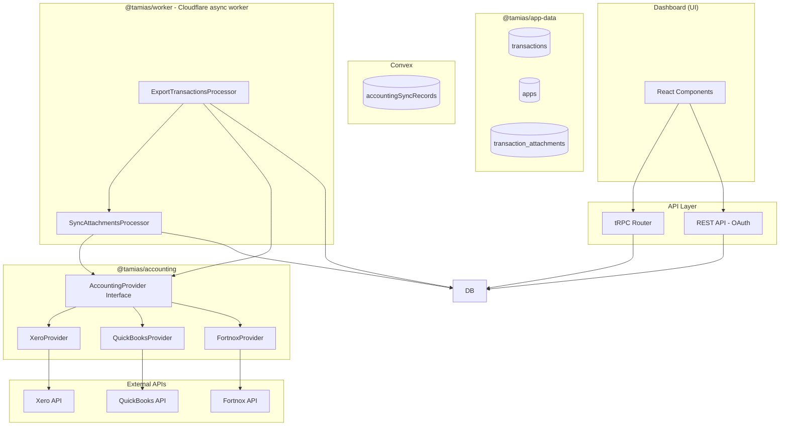
```mermaid
flowchart TB
    subgraph Dashboard["Dashboard (UI)"]
        UI[React Components]
    end

    subgraph API["API Layer"]
        TRPC[tRPC Router]
        REST[REST API - OAuth]
    end

    subgraph AppData["@tamias/app-data"]
        TXN[(transactions)]
        APPS[(apps)]
        ATT[(transaction_attachments)]
    end

    subgraph Convex["Convex"]
        SYNC[(accountingSyncRecords)]
    end

    subgraph Worker["@tamias/worker - Cloudflare async worker"]
        PROC2[SyncAttachmentsProcessor]
        PROC3[ExportTransactionsProcessor]
    end

    subgraph Accounting["@tamias/accounting"]
        IFACE[AccountingProvider Interface]
        XERO[XeroProvider]
        QB[QuickBooksProvider]
        FNX[FortnoxProvider]
    end

    subgraph External["External APIs"]
        XERO_API[Xero API]
        QB_API[QuickBooks API]
        FNX_API[Fortnox API]
    end

    UI --> TRPC
    UI --> REST
    TRPC --> DB
    REST --> DB

    PROC3 --> PROC2

    PROC2 --> IFACE
    PROC3 --> IFACE

    IFACE --> XERO
    IFACE --> QB
    IFACE --> FNX

    XERO --> XERO_API
    QB --> QB_API
    FNX --> FNX_API

    PROC2 --> DB
    PROC3 --> DB
```

#### Package Structure

```
packages/accounting/
├── src/
│   ├── index.ts              # Factory and exports
│   ├── provider.ts           # AccountingProvider interface
│   ├── types.ts              # Shared types
│   ├── utils.ts              # OAuth state encryption, utilities
│   └── providers/
│       ├── xero.ts           # Xero implementation
│       ├── quickbooks.ts     # QuickBooks implementation
│       └── fortnox.ts        # Fortnox implementation
├── package.json
└── tsconfig.json

worker/src/
├── processors/accounting/
│   ├── index.ts              # Processor exports
│   ├── base.ts               # Shared processor logic
│   ├── sync-attachments.ts   # Attachment upload processor
│   └── export-transactions.ts# Manual export processor
├── cloudflare/
│   └── index.ts              # Cloudflare queue/workflow entrypoint
├── schemas/
│   └── accounting.ts         # Zod schemas for job payloads
└── utils/
    └── accounting-auth.ts    # Token refresh utilities
```

---

### Data Flow

#### Manual Export Flow

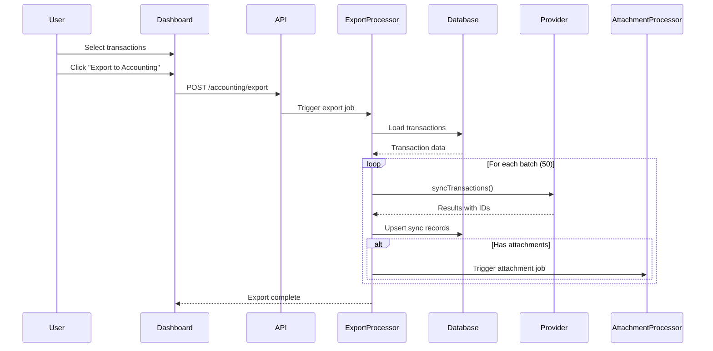
```mermaid
sequenceDiagram
    participant User
    participant Dashboard
    participant API
    participant ExportProcessor
    participant Database
    participant Provider
    participant AttachmentProcessor

    User->>Dashboard: Select transactions
    User->>Dashboard: Click "Export to Accounting"
    Dashboard->>API: POST /accounting/export
    API->>ExportProcessor: Trigger export job
    ExportProcessor->>Database: Load transactions
    Database-->>ExportProcessor: Transaction data

    loop For each batch (50)
        ExportProcessor->>Provider: syncTransactions()
        Provider-->>ExportProcessor: Results with IDs
        ExportProcessor->>Database: Upsert sync records

        alt Has attachments
            ExportProcessor->>AttachmentProcessor: Trigger attachment job
        end
    end

    ExportProcessor-->>Dashboard: Export complete
```

#### OAuth Authentication Flow

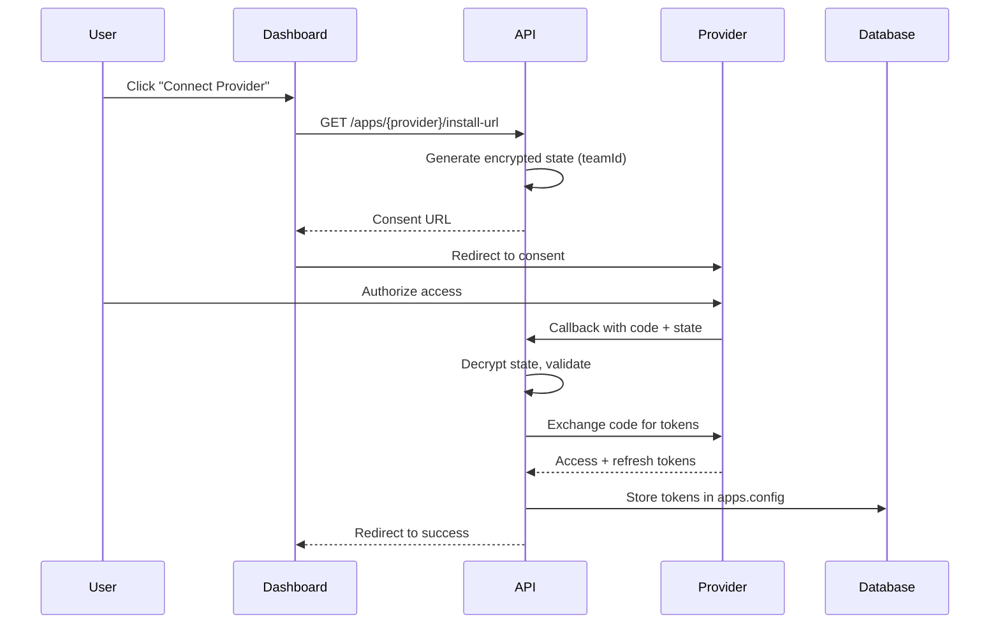
```mermaid
sequenceDiagram
    participant User
    participant Dashboard
    participant API
    participant Provider
    participant Database

    User->>Dashboard: Click "Connect Provider"
    Dashboard->>API: GET /apps/{provider}/install-url
    API->>API: Generate encrypted state (teamId)
    API-->>Dashboard: Consent URL
    Dashboard->>Provider: Redirect to consent
    User->>Provider: Authorize access
    Provider->>API: Callback with code + state
    API->>API: Decrypt state, validate
    API->>Provider: Exchange code for tokens
    Provider-->>API: Access + refresh tokens
    API->>Database: Store tokens in apps.config
    API-->>Dashboard: Redirect to success
```

---

### Accounting Sync Store

`accountingSyncRecords` is stored in Convex and tracks export status for each transaction per provider.

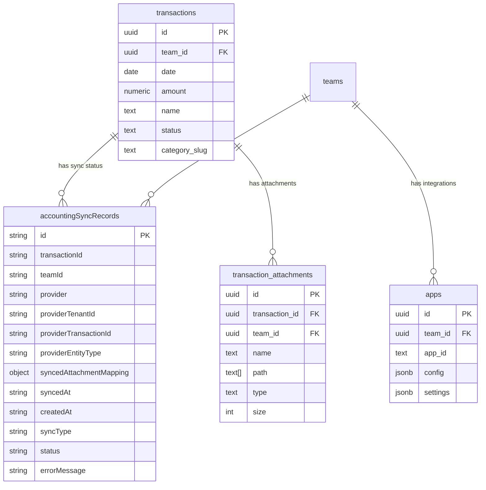
```mermaid
erDiagram
    transactions ||--o{ accountingSyncRecords : "has sync status"
    transactions ||--o{ transaction_attachments : "has attachments"
    teams ||--o{ accountingSyncRecords : "owns"
    teams ||--o{ apps : "has integrations"

    transactions {
        uuid id PK
        uuid team_id FK
        date date
        numeric amount
        text name
        text status
        text category_slug
    }

    accountingSyncRecords {
        string id PK
        string transactionId
        string teamId
        string provider
        string providerTenantId
        string providerTransactionId
        string providerEntityType
        object syncedAttachmentMapping
        string syncedAt
        string createdAt
        string syncType
        string status
        string errorMessage
    }

    transaction_attachments {
        uuid id PK
        uuid transaction_id FK
        uuid team_id FK
        text name
        text[] path
        text type
        int size
    }

    apps {
        uuid id PK
        uuid team_id FK
        text app_id
        jsonb config
        jsonb settings
    }
```

#### apps.config Structure

OAuth tokens and settings stored in JSONB config field:

```typescript
interface AccountingProviderConfig {
  accessToken: string;
  refreshToken: string;
  expiresAt: string; // ISO timestamp
  tenantId: string; // Organization ID (realmId for QB)
  tenantName?: string; // Organization name
}
```

---

### Export Logic

#### Transaction Selection

Users manually select which transactions to export. The system validates that transactions are eligible:

| Condition          | Exports | Reason                   |
| ------------------ | ------- | ------------------------ |
| Status = pending   | Yes     | User can export anytime  |
| Status = completed | Yes     | User marked as done      |
| Status = excluded  | No      | User excluded from books |
| Status = archived  | No      | Old transaction          |

#### Re-export Behavior

- **Always creates new entries**: Re-exporting creates new transactions/vouchers in the accounting provider
- **No updates**: Accounting providers have limited or no update support (Fortnox vouchers are immutable)
- **Sync records updated**: The latest provider transaction ID is stored
- **User responsibility**: Users should delete old entries in accounting software if needed

#### Provider-Specific Behavior

| Provider   | Entity Type      | Idempotency         | Notes                             |
| ---------- | ---------------- | ------------------- | --------------------------------- |
| Xero       | BankTransaction  | `updateOrCreate`    | SPEND/RECEIVE, deterministic keys |
| QuickBooks | Purchase/Deposit | `Request-Id` header | Based on amount sign              |
| Fortnox    | Voucher          | None (immutable)    | Posted vouchers, double-entry     |

#### Important: Re-Export Behavior

- **Xero**: Uses `updateOrCreateBankTransactions` - re-exporting the same transaction **updates** it rather than creating duplicates
- **QuickBooks**: Uses idempotency headers but creates new entities on re-export
- **Fortnox**: Vouchers are **immutable** via API - re-exporting always creates a new voucher. Users must manually delete old vouchers in Fortnox if needed

---

### Authentication

#### Token Management

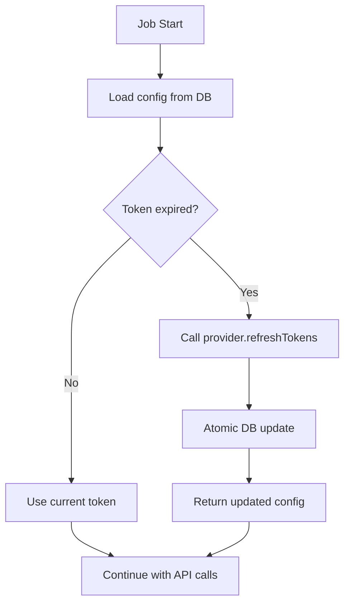
```mermaid
flowchart TD
    A[Job Start] --> B[Load config from DB]
    B --> C{Token expired?}
    C -->|No| D[Use current token]
    C -->|Yes| E[Call provider.refreshTokens]
    E --> F[Atomic DB update]
    F --> G[Return updated config]
    D --> H[Continue with API calls]
    G --> H
```

OAuth tokens are managed through the `ensureValidToken` utility:

```typescript
export const ensureValidToken = async (
  db: Database,
  provider: AccountingProvider,
  config: AccountingProviderConfig,
  teamId: string,
  providerId: string,
): Promise<AccountingProviderConfig> => {
  if (!provider.isTokenExpired(new Date(config.expiresAt))) {
    return config;
  }

  const newTokens = await provider.refreshTokens(config.refreshToken);

  await updateAppTokens(db, {
    teamId,
    appId: providerId,
    ...newTokens,
  });

  return { ...config, ...newTokens };
};
```

---

### Worker Jobs

#### Queue Configuration

```typescript
const accountingQueueOptions: QueueOptions = {
  defaultJobOptions: {
    attempts: 4,
    backoff: {
      type: "exponential",
      delay: 5 * 60 * 1000, // 5 minutes initial
    },
    removeOnComplete: { age: 24 * 3600, count: 100 },
    removeOnFail: { age: 7 * 24 * 3600, count: 500 },
  },
};
```

#### Retry Sequence

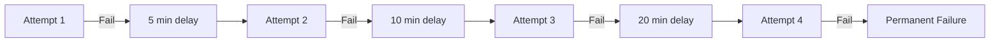
```mermaid
flowchart LR
    A[Attempt 1] -->|Fail| B[5 min delay]
    B --> C[Attempt 2]
    C -->|Fail| D[10 min delay]
    D --> E[Attempt 3]
    E -->|Fail| F[20 min delay]
    F --> G[Attempt 4]
    G -->|Fail| H[Permanent Failure]
```

#### Job Types

| Job Name                      | Processor                   | Trigger     | Purpose                        |
| ----------------------------- | --------------------------- | ----------- | ------------------------------ |
| `export-to-accounting`        | ExportTransactionsProcessor | User action | Export selected transactions   |
| `sync-accounting-attachments` | SyncAttachmentsProcessor    | Export job  | Upload attachments to provider |

---

### API Reference

#### AccountingProvider Interface

```typescript
interface AccountingProvider {
  // OAuth
  buildConsentUrl(state: string): Promise<string>;
  exchangeCodeForTokens(code: string): Promise<TokenSet>;
  refreshTokens(refreshToken: string): Promise<TokenSet>;
  isTokenExpired(expiresAt: Date, bufferSeconds?: number): boolean;

  // Tenant Info
  getTenantInfo(tenantId: string): Promise<TenantInfo>;
  getTenants(): Promise<TenantInfo[]>;

  // Accounts
  getAccounts(tenantId: string): Promise<AccountingAccount[]>;

  // Transactions
  syncTransactions(params: SyncTransactionsParams): Promise<SyncResult>;

  // Attachments
  uploadAttachment(params: UploadAttachmentParams): Promise<AttachmentResult>;
  deleteAttachment(params: DeleteAttachmentParams): Promise<DeleteAttachmentResult>;

  // Health Check
  checkConnection(): Promise<{ connected: boolean; error?: string }>;

  // Cleanup (optional)
  disconnect?(): Promise<void>;
}
```

#### Database Queries

```typescript
// Get transactions for export
getTransactionsForAccountingSync(db, {
  teamId: string,
  provider: ProviderType,
  transactionIds: string[],  // Required for manual export
  limit?: number,
}): Promise<TransactionForSync[]>

// Upsert sync record
upsertAccountingSyncRecord(db, {
  transactionId: string,
  teamId: string,
  provider: ProviderType,
  providerTenantId: string,
  providerTransactionId?: string,
  providerEntityType?: string,
  // Maps Tamias attachment IDs to provider attachment IDs
  syncedAttachmentMapping?: Record<string, string | null>,
  syncType: 'manual',
  status: 'synced' | 'failed' | 'pending',
  errorMessage?: string,
}): Promise<AccountingSyncRecord>

// Update attachment mapping after sync
updateSyncedAttachmentMapping(db, {
  syncRecordId: string,
  syncedAttachmentMapping: Record<string, string | null>,
}): Promise<AccountingSyncRecord>
```

---

### Configuration

#### Environment Variables

```bash
# Xero
XERO_CLIENT_ID=your_client_id
XERO_CLIENT_SECRET=your_client_secret
XERO_OAUTH_REDIRECT_URL=https://api.tamias.xyz/v1/apps/xero/oauth-callback

# QuickBooks
QUICKBOOKS_CLIENT_ID=your_client_id
QUICKBOOKS_CLIENT_SECRET=your_client_secret
QUICKBOOKS_OAUTH_REDIRECT_URL=https://api.tamias.xyz/v1/apps/quickbooks/oauth-callback

# Fortnox
FORTNOX_CLIENT_ID=your_client_id
FORTNOX_CLIENT_SECRET=your_client_secret
FORTNOX_OAUTH_REDIRECT_URL=https://api.tamias.xyz/v1/apps/fortnox/oauth-callback

# OAuth state encryption
ACCOUNTING_OAUTH_SECRET=32_byte_encryption_key
```

---

### Error Handling

#### Retry Strategy

| Error Type         | Retry | Notes                    |
| ------------------ | ----- | ------------------------ |
| Network timeout    | Yes   | Exponential backoff      |
| Rate limit (429)   | Yes   | Backoff allows recovery  |
| Auth failure (401) | Yes   | Token refresh attempted  |
| Invalid data (400) | No    | Logged, marked as failed |
| Server error (5xx) | Yes   | Provider may recover     |

#### Error Recording

Failed exports are recorded with error details:

```typescript
await upsertAccountingSyncRecord(db, {
  transactionId: tx.id,
  teamId,
  provider: providerId,
  status: "failed",
  errorMessage: error.message,
});
```

---

### Security Considerations

1. **Token Storage**: OAuth tokens stored encrypted in database
2. **State Parameter**: OAuth state encrypted with HMAC to prevent CSRF
3. **RLS Policies**: Database enforces team-level access control
4. **API Keys**: Provider credentials stored in environment variables
5. **Audit Trail**: Sync records provide full export history

---

### Rate Limiting & Reliability

#### Provider Rate Limits (2025)

| Provider   | Calls/Min | Concurrent | Daily | Notes         |
| ---------- | --------- | ---------- | ----- | ------------- |
| Xero       | 60        | 5          | 5,000 | Per tenant    |
| QuickBooks | 500       | 10         | None  | Per realm     |
| Fortnox    | ~300      | 3          | None  | ~25/5 seconds |

#### Job-Level Rate Limiting

Attachment jobs are created with **calculated delays** to stay under rate limits:

```typescript
// export-transactions.ts
function calculateAttachmentJobDelay(providerId: string, jobIndex: number): number {
  const rateLimit = RATE_LIMITS[providerId]?.callsPerMinute ?? 60;
  const msPerJob = Math.ceil((60000 / rateLimit) * 1.1); // 1.1x buffer
  return jobIndex * msPerJob;
}
// Xero: Job 0 = 0ms, Job 1 = 1100ms, Job 2 = 2200ms, ...
```

**Benefits:**

- Jobs are in "delayed" state, not blocking workers
- Different teams process in parallel (no blocking)
- Zero rate limit errors (jobs are pre-spaced)
- No runtime rate limit checking needed

#### Within-Job Concurrency

For transactions with multiple attachments, uploads are batched:

```typescript
const RATE_LIMITS = {
  xero: { maxConcurrent: 3, callDelayMs: 1500 },
  quickbooks: { maxConcurrent: 10, callDelayMs: 200 },
  fortnox: { maxConcurrent: 3, callDelayMs: 600 },
};
```

#### Transaction Sorting

All providers sort transactions by date before export:

- Ensures chronological order in accounting software
- Fortnox: Voucher numbers assigned in creation order
- Xero/QuickBooks: Cleaner transaction lists

#### Estimated Export Times

| Transactions + Attachments | Xero    | QuickBooks | Fortnox |
| -------------------------- | ------- | ---------- | ------- |
| 200                        | ~4 min  | ~30 sec    | ~1 min  |
| 1000                       | ~18 min | ~2 min     | ~4 min  |
| 2000                       | ~37 min | ~4 min     | ~8 min  |

**Note:** Xero has a daily limit of 5,000 calls. Exports larger than ~4,500 attachments may span multiple days.

---

### Limitations

1. **No Updates**: Re-exporting creates new entries; existing entries cannot be updated
2. **Attachment Deletion**: Partial support - QuickBooks and Fortnox support deletion, Xero does not (attachments remain in Xero)
3. **Bank Account Mapping**: Currently uses first active account; multi-account mapping planned
4. **Rate Limits**: Subject to provider API rate limits (handled automatically with throttling)
5. **Fortnox Vouchers**: Created as posted entries (Fortnox API doesn't support draft vouchers via API)

---

## Accounting sync architecture (deep dive)

Deep technical documentation of the accounting sync system architecture.

### System Components

#### Provider Abstraction Layer

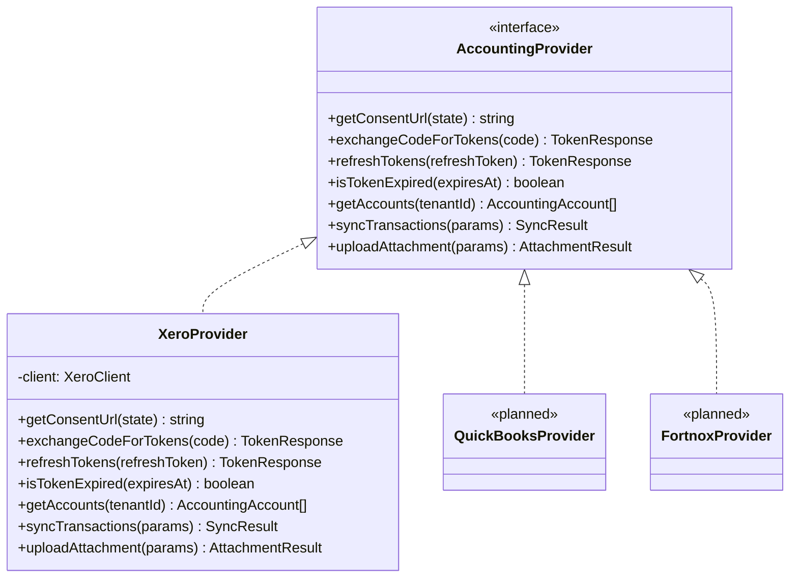
```mermaid
classDiagram
    class AccountingProvider {
        <<interface>>
        +getConsentUrl(state) string
        +exchangeCodeForTokens(code) TokenResponse
        +refreshTokens(refreshToken) TokenResponse
        +isTokenExpired(expiresAt) boolean
        +getAccounts(tenantId) AccountingAccount[]
        +syncTransactions(params) SyncResult
        +uploadAttachment(params) AttachmentResult
    }

    class XeroProvider {
        -client: XeroClient
        +getConsentUrl(state) string
        +exchangeCodeForTokens(code) TokenResponse
        +refreshTokens(refreshToken) TokenResponse
        +isTokenExpired(expiresAt) boolean
        +getAccounts(tenantId) AccountingAccount[]
        +syncTransactions(params) SyncResult
        +uploadAttachment(params) AttachmentResult
    }

    class QuickBooksProvider {
        <<planned>>
    }

    class FortnoxProvider {
        <<planned>>
    }

    AccountingProvider <|.. XeroProvider
    AccountingProvider <|.. QuickBooksProvider
    AccountingProvider <|.. FortnoxProvider
```

#### Worker Pipeline

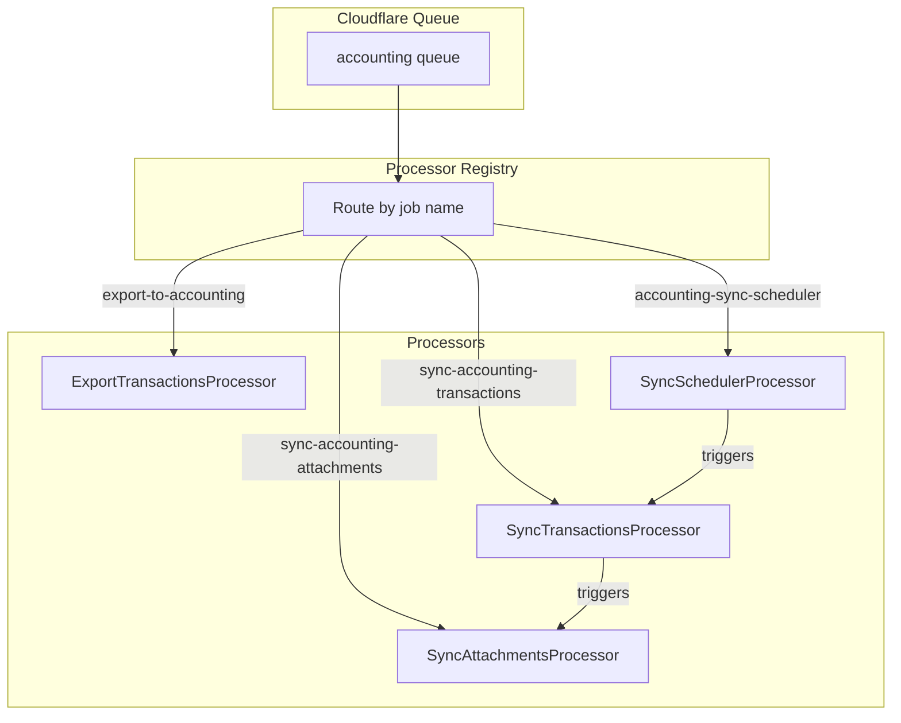
```mermaid
flowchart TB
    subgraph AsyncQueue["Cloudflare Queue"]
        Q[accounting queue]
    end

    subgraph Registry["Processor Registry"]
        R[Route by job name]
    end

    subgraph Processors["Processors"]
        P1[SyncTransactionsProcessor]
        P2[SyncAttachmentsProcessor]
        P3[ExportTransactionsProcessor]
        P4[SyncSchedulerProcessor]
    end

    Q --> R
    R -->|sync-accounting-transactions| P1
    R -->|sync-accounting-attachments| P2
    R -->|export-to-accounting| P3
    R -->|accounting-sync-scheduler| P4

    P1 --> |triggers| P2
    P4 --> |triggers| P1
```

#### Data Layer

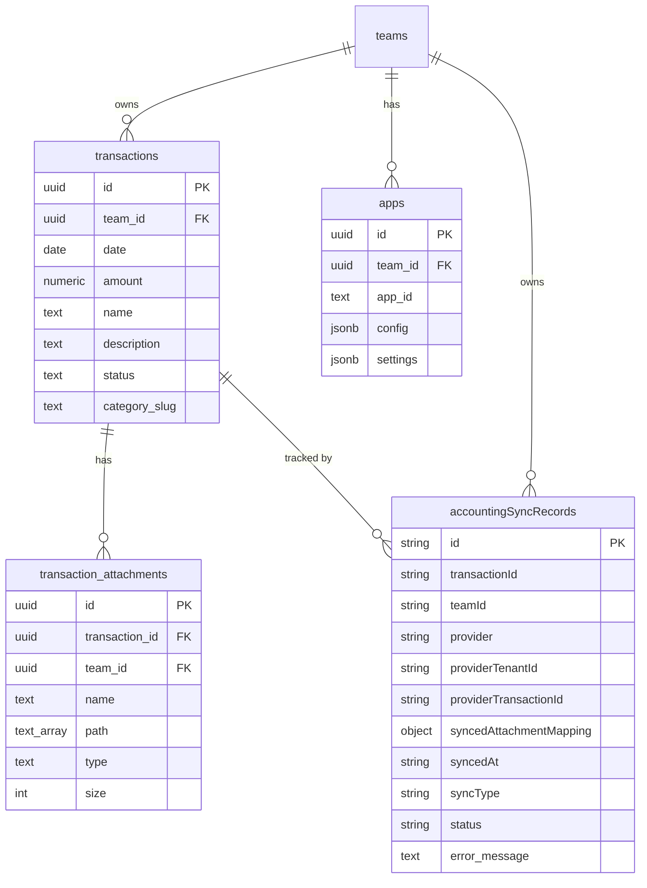
```mermaid
erDiagram
    teams ||--o{ transactions : "owns"
    teams ||--o{ apps : "has"
    teams ||--o{ accountingSyncRecords : "owns"

    transactions ||--o{ transaction_attachments : "has"
    transactions ||--o{ accountingSyncRecords : "tracked by"

    transactions {
        uuid id PK
        uuid team_id FK
        date date
        numeric amount
        text name
        text description
        text status
        text category_slug
    }

    transaction_attachments {
        uuid id PK
        uuid transaction_id FK
        uuid team_id FK
        text name
        text_array path
        text type
        int size
    }

    apps {
        uuid id PK
        uuid team_id FK
        text app_id
        jsonb config
        jsonb settings
    }

    accountingSyncRecords {
        string id PK
        string transactionId
        string teamId
        string provider
        string providerTenantId
        string providerTransactionId
        object syncedAttachmentMapping
        string syncedAt
        string syncType
        string status
        text error_message
    }
```

---

### Sync Algorithm

#### Phase 1: Transaction Selection

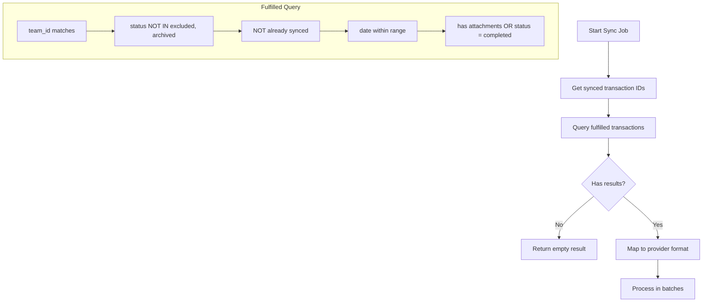
```mermaid
flowchart TD
    A[Start Sync Job] --> B[Get synced transaction IDs]
    B --> C[Query fulfilled transactions]
    C --> D{Has results?}
    D -->|No| E[Return empty result]
    D -->|Yes| F[Map to provider format]
    F --> G[Process in batches]

    subgraph Query["Fulfilled Query"]
        C1[team_id matches]
        C2[status NOT IN excluded, archived]
        C3[NOT already synced]
        C4[date within range]
        C5[has attachments OR status = completed]
        C1 --> C2 --> C3 --> C4 --> C5
    end
```

#### Phase 2: Batch Processing

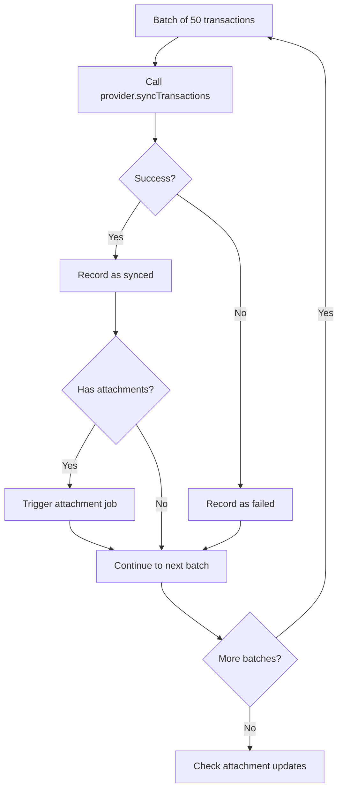
```mermaid
flowchart TD
    A[Batch of 50 transactions] --> B[Call provider.syncTransactions]
    B --> C{Success?}

    C -->|Yes| D[Record as synced]
    C -->|No| E[Record as failed]

    D --> F{Has attachments?}
    F -->|Yes| G[Trigger attachment job]
    F -->|No| H[Continue to next batch]

    E --> H
    G --> H

    H --> I{More batches?}
    I -->|Yes| A
    I -->|No| J[Check attachment updates]
```

#### Phase 3: Attachment Detection

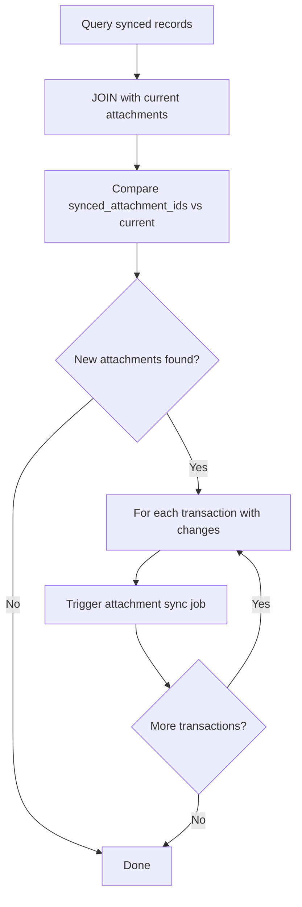
```mermaid
flowchart TD
    A[Query synced records] --> B[JOIN with current attachments]
    B --> C[Compare synced_attachment_ids vs current]

    C --> D{New attachments found?}
    D -->|No| E[Done]
    D -->|Yes| F[For each transaction with changes]

    F --> G[Trigger attachment sync job]
    G --> H{More transactions?}
    H -->|Yes| F
    H -->|No| E
```

---

### Token Lifecycle

#### Refresh Flow

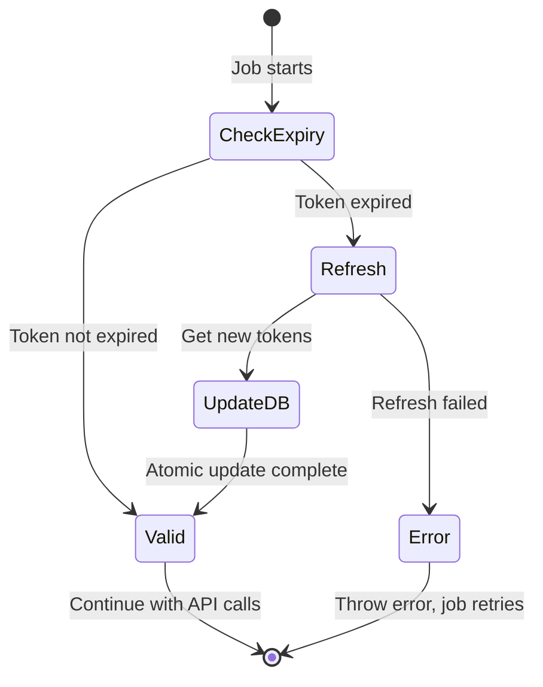
```mermaid
stateDiagram-v2
    [*] --> CheckExpiry: Job starts

    CheckExpiry --> Valid: Token not expired
    CheckExpiry --> Refresh: Token expired

    Refresh --> UpdateDB: Get new tokens
    UpdateDB --> Valid: Atomic update complete

    Valid --> [*]: Continue with API calls

    Refresh --> Error: Refresh failed
    Error --> [*]: Throw error, job retries
```

#### Atomic Update

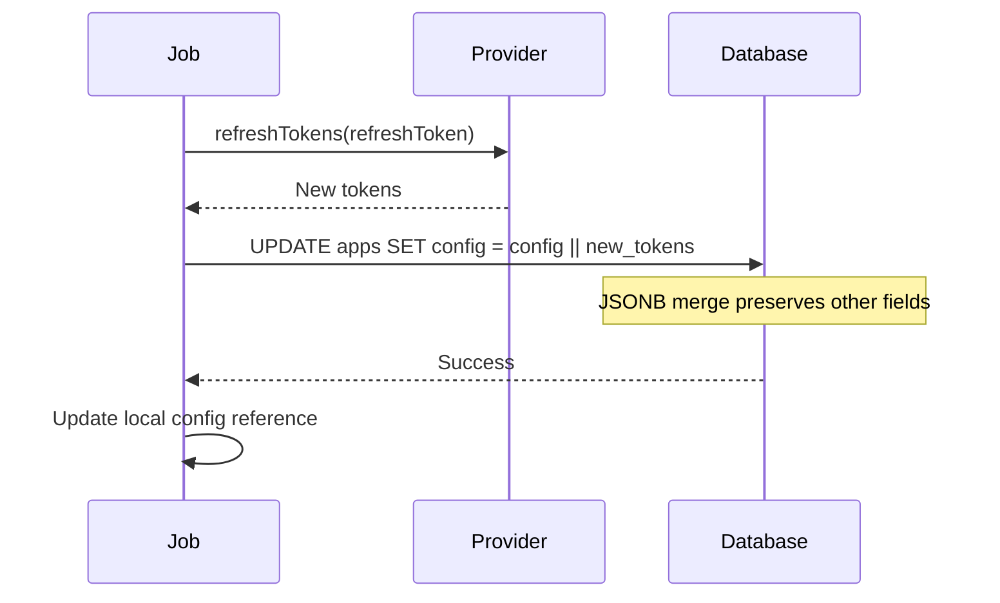
```mermaid
sequenceDiagram
    participant Job
    participant Provider
    participant Database

    Job->>Provider: refreshTokens(refreshToken)
    Provider-->>Job: New tokens

    Job->>Database: UPDATE apps SET config = config || new_tokens
    Note over Database: JSONB merge preserves other fields
    Database-->>Job: Success

    Job->>Job: Update local config reference
```

---

### Retry Mechanism

#### Async Runtime Configuration

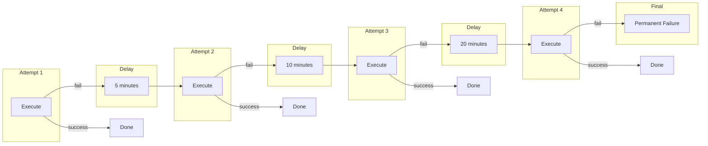
```mermaid
flowchart LR
    subgraph Attempt1["Attempt 1"]
        A1[Execute]
    end

    subgraph Delay1["Delay"]
        D1[5 minutes]
    end

    subgraph Attempt2["Attempt 2"]
        A2[Execute]
    end

    subgraph Delay2["Delay"]
        D2[10 minutes]
    end

    subgraph Attempt3["Attempt 3"]
        A3[Execute]
    end

    subgraph Delay3["Delay"]
        D3[20 minutes]
    end

    subgraph Attempt4["Attempt 4"]
        A4[Execute]
    end

    subgraph Final["Final"]
        F[Permanent Failure]
    end

    A1 -->|fail| D1 --> A2
    A2 -->|fail| D2 --> A3
    A3 -->|fail| D3 --> A4
    A4 -->|fail| F

    A1 -->|success| S1[Done]
    A2 -->|success| S2[Done]
    A3 -->|success| S3[Done]
    A4 -->|success| S4[Done]
```

#### Error Classification

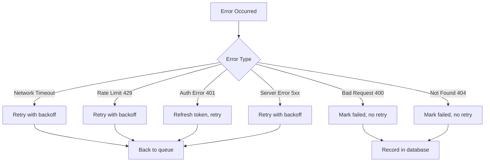
```mermaid
flowchart TD
    E[Error Occurred] --> T{Error Type}

    T -->|Network Timeout| R1[Retry with backoff]
    T -->|Rate Limit 429| R2[Retry with backoff]
    T -->|Auth Error 401| R3[Refresh token, retry]
    T -->|Bad Request 400| F1[Mark failed, no retry]
    T -->|Not Found 404| F2[Mark failed, no retry]
    T -->|Server Error 5xx| R4[Retry with backoff]

    R1 --> Q[Back to queue]
    R2 --> Q
    R3 --> Q
    R4 --> Q

    F1 --> D[Record in database]
    F2 --> D
```

---

### Concurrency Model

#### Queue Worker Settings

```typescript
const workerOptions: WorkerOptions = {
  concurrency: 10, // Max 10 jobs in parallel
  lockDuration: 300000, // 5 minute lock (API can be slow)
  stalledInterval: 5 * 60 * 1000,
  maxStalledCount: 1,
  limiter: {
    max: 20, // Max 20 jobs per second
    duration: 1000,
  },
};
```

#### Job Isolation

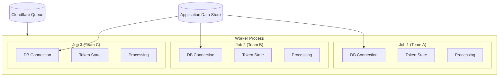
```mermaid
flowchart TB
    subgraph Worker["Worker Process"]
        subgraph Job1["Job 1 (Team A)"]
            DB1[DB Connection]
            TOK1[Token State]
            PROC1[Processing]
        end

        subgraph Job2["Job 2 (Team B)"]
            DB2[DB Connection]
            TOK2[Token State]
            PROC2[Processing]
        end

        subgraph Job3["Job 3 (Team C)"]
            DB3[DB Connection]
            TOK3[Token State]
            PROC3[Processing]
        end
    end

    Queue[(Cloudflare Queue)] --> Worker
    DataStore[(Application Data Store)] --> DB1
    DataStore --> DB2
    DataStore --> DB3
```

---

### Data Mapping

#### Tamias to Xero Transaction Mapping

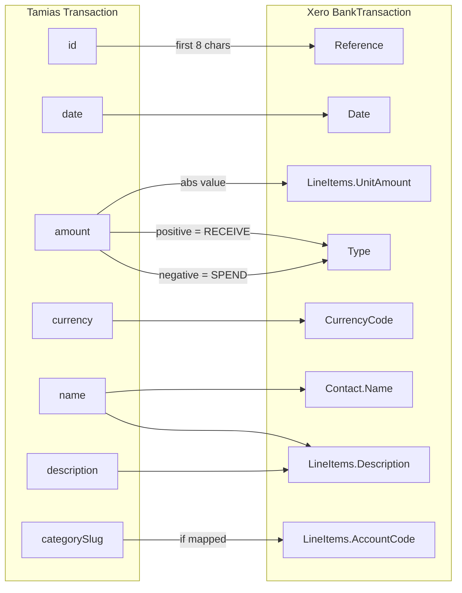
```mermaid
flowchart LR
    subgraph Tamias["Tamias Transaction"]
        M1[id]
        M2[date]
        M3[amount]
        M4[currency]
        M5[name]
        M6[description]
        M7[categorySlug]
    end

    subgraph Xero["Xero BankTransaction"]
        X1[Reference]
        X2[Date]
        X3[LineItems.UnitAmount]
        X4[CurrencyCode]
        X5[Contact.Name]
        X6[LineItems.Description]
        X7[LineItems.AccountCode]
        X8[Type]
    end

    M1 -->|first 8 chars| X1
    M2 --> X2
    M3 -->|abs value| X3
    M3 -->|positive = RECEIVE| X8
    M3 -->|negative = SPEND| X8
    M4 --> X4
    M5 --> X5
    M5 --> X6
    M6 --> X6
    M7 -->|if mapped| X7
```

#### Attachment Upload Flow

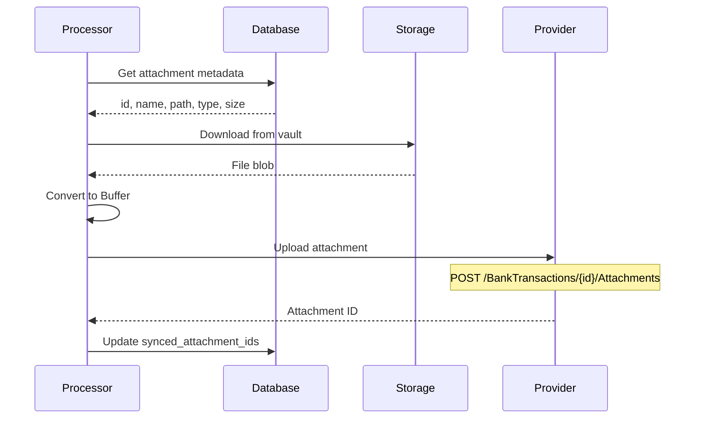
```mermaid
sequenceDiagram
    participant Processor
    participant Database
    participant Storage
    participant Provider

    Processor->>Database: Get attachment metadata
    Database-->>Processor: id, name, path, type, size

    Processor->>Storage: Download from vault
    Storage-->>Processor: File blob

    Processor->>Processor: Convert to Buffer

    Processor->>Provider: Upload attachment
    Note over Provider: POST /BankTransactions/{id}/Attachments
    Provider-->>Processor: Attachment ID

    Processor->>Database: Update synced_attachment_ids
```

---

### Performance Characteristics

#### Query Complexity

| Query                     | Complexity | Index Used                        |
| ------------------------- | ---------- | --------------------------------- |
| Get synced IDs            | O(n)       | idx_accounting_sync_team_provider |
| Get transactions for sync | O(n log n) | transactions PK + team_id         |
| Detect attachment changes | O(n)       | Single JOIN, grouped              |
| Upsert sync record        | O(1)       | Unique constraint                 |

#### Batch Sizes

| Operation         | Batch Size | Rationale                            |
| ----------------- | ---------- | ------------------------------------ |
| Transaction sync  | 50         | Balance between API calls and memory |
| Attachment upload | 1          | Sequential for error isolation       |
| Progress updates  | Per batch  | User feedback without overhead       |

#### Rate Limits

| Provider | Limit           | Tamias Handling                             |
| -------- | --------------- | ------------------------------------------- |
| Xero     | 60 calls/minute | Async worker concurrency + provider backoff |
| Xero     | 5000 calls/day  | Batch processing reduces calls              |

---

### Security Model

#### Data Access

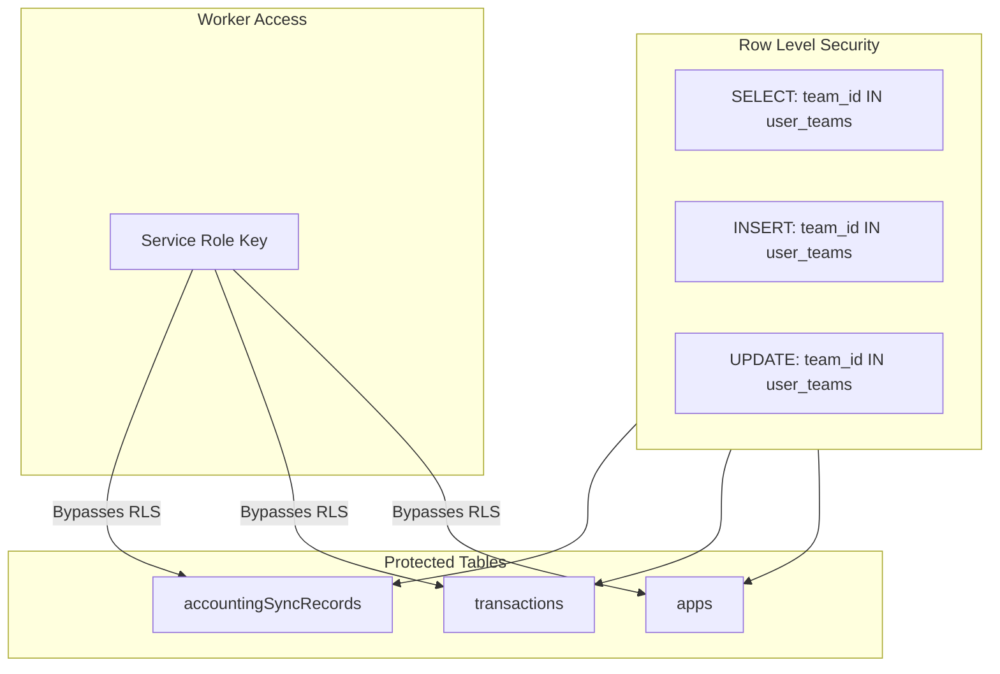
```mermaid
flowchart TD
    subgraph RLS["Row Level Security"]
        P1[SELECT: team_id IN user_teams]
        P2[INSERT: team_id IN user_teams]
        P3[UPDATE: team_id IN user_teams]
    end

    subgraph Tables["Protected Tables"]
        T1[accountingSyncRecords]
        T2[transactions]
        T3[apps]
    end

    subgraph Worker["Worker Access"]
        W[Service Role Key]
    end

    RLS --> T1
    RLS --> T2
    RLS --> T3

    W -->|Bypasses RLS| T1
    W -->|Bypasses RLS| T2
    W -->|Bypasses RLS| T3
```

#### Secret Storage

| Secret Type            | Storage          | Access                  |
| ---------------------- | ---------------- | ----------------------- |
| OAuth Client ID/Secret | Environment vars | Worker process only     |
| Access Token           | apps.config (DB) | Encrypted at rest       |
| Refresh Token          | apps.config (DB) | Encrypted at rest       |
| OAuth State            | Encrypted string | HMAC with server secret |

---

## Categories and tax

A comprehensive financial category system for SMBs with international tax rate support.

### Features

- **Hierarchical Categories**: Parent-child structure for comprehensive financial reporting
- **International Tax Rates**: Support for 31+ countries with VAT/GST/sales tax rates
- **Backward Compatibility**: Preserves existing category slugs
- **Built-in Names**: All categories include display names

### Installation

```bash
bun add @tamias/categories
```

### Usage

#### Basic Category Access

```typescript
import { CATEGORIES, getCategoryBySlug, getParentCategory } from "@tamias/categories";

// Get all categories
const allCategories = CATEGORIES;

// Find a specific category
const softwareCategory = getCategoryBySlug("software");

// Get parent category
const parent = getParentCategory("software"); // Returns 'technology'
```

#### Tax Rate Lookup

```typescript
import { getTaxRateForCategory, getTaxTypeForCountry } from "@tamias/categories";

// Get tax rate for a category in a specific country
const taxRate = getTaxRateForCategory("SE", "meals"); // Returns 12 (Sweden, reduced rate)

// Get tax type for a country
const taxType = getTaxTypeForCountry("SE"); // Returns 'vat'
```

#### Category Names

All categories include built-in display names that can be used directly:

```typescript
// Access category names directly
const revenueCategory = getCategoryBySlug("revenue");
console.log(revenueCategory.name); // "Revenue"

const officeSupplies = getCategoryBySlug("office-supplies");
console.log(officeSupplies.name); // "Office Supplies"
```

#### Category Colors

Each category has a predefined color for consistent UI representation:

```typescript
import { getCategoryColor, CATEGORY_COLOR_MAP } from "@tamias/categories";

// Get color for any category
const revenueColor = getCategoryColor("revenue"); // "#00D084" (Green)
const officeSuppliesColor = getCategoryColor("office-supplies"); // "#8ED1FC" (Sky Blue)

// Access the complete color map
const allColors = CATEGORY_COLOR_MAP;
```

**Color Philosophy:**

- **Revenue categories**: Green variations (income, growth)
- **Cost categories**: Orange variations (expenses, caution)
- **Each parent category**: Distinct base color
- **Child categories**: Harmonious variations of parent color

### Category Structure

The system includes 14 parent categories:

1. **Revenue** - Business income streams
2. **Cost of Goods Sold** - Direct production costs
3. **Sales & Marketing** - Marketing and sales expenses
4. **Operations** - Day-to-day operational costs
5. **Professional Services** - External professional services
6. **Human Resources** - Employee-related costs
7. **Travel & Entertainment** - Business travel and entertainment
8. **Technology** - Software and tech subscriptions
9. **Banking & Finance** - Financial services and fees
10. **Assets & CapEx** - Capital expenditures
11. **Liabilities & Debt** - Debt obligations
12. **Taxes & Government** - Tax payments and government fees
13. **Owner / Equity** - Owner transactions and investments
14. **System** - System categories (uncategorized, other)

### Supported Countries

The package includes tax rate configurations for:

- **Nordic**: SE, FI, NO, DK
- **EU**: DE, FR, NL, BE, AT, IT, ES, PL, CZ, PT, LU, EE, LV, LT, SK, SI, RO, HU
- **Other**: US, GB, CA, AU, NZ, CH, IE, TR

### Migration

Existing transactions using legacy category slugs (e.g., "office-supplies", "travel") will continue to work without any data migration needed.

### API Reference

See the TypeScript types for complete API documentation.

---

## Inbox connectors

Email inbox integration package for syncing PDF attachments from Gmail and Outlook accounts.

### Overview

This package provides OAuth-based email provider integrations that:

- Connect user email accounts via OAuth 2.0
- Sync PDF attachments from incoming emails
- Handle token refresh and expiration automatically
- Provide structured error handling for robust sync operations

### Architecture

```
┌─────────────────────────────────────────────────────────────┐
│                     InboxConnector                          │
│  - Orchestrates provider selection                          │
│  - Handles token decryption/encryption                      │
│  - Manages retry logic with token refresh                   │
└─────────────────────────────────────────────────────────────┘
                              │
              ┌───────────────┴───────────────┐
              ▼                               ▼
┌─────────────────────────┐     ┌─────────────────────────┐
│      GmailProvider      │     │     OutlookProvider     │
│  - Google OAuth2        │     │  - Microsoft OAuth2     │
│  - Gmail API v1         │     │  - Microsoft Graph API  │
│  - Proactive refresh    │     │  - Custom AuthProvider  │
└─────────────────────────┘     └─────────────────────────┘
              │                               │
              └───────────────┬───────────────┘
                              ▼
┌─────────────────────────────────────────────────────────────┐
│                    Structured Errors                        │
│  - InboxAuthError (authentication/authorization)            │
│  - InboxSyncError (transient sync issues)                   │
└─────────────────────────────────────────────────────────────┘
```

### Usage

#### Connecting an Account

```typescript
import { InboxConnector } from "@tamias/inbox/connector";

const connector = new InboxConnector("gmail");

// Get OAuth URL for user to authorize
const authUrl = await connector.connect();

// After user authorizes, exchange code for account
const account = await connector.exchangeCodeForAccount({
  code: authorizationCode,
  teamId: "team_123",
});
```

#### Syncing Attachments

```typescript
const attachments = await connector.getAttachments({
  id: accountId,
  teamId: "team_123",
  maxResults: 50,
  fullSync: false, // true for initial/manual sync
});

for (const attachment of attachments) {
  console.log(attachment.filename, attachment.size);
  // attachment.data contains the file buffer
}
```

### Error Handling

The package uses structured error classes for type-safe error handling.

#### Error Types

##### InboxAuthError

Authentication and authorization errors. Check `requiresReauth` to determine if user action is needed.

```typescript
import { InboxAuthError, isInboxAuthError } from "@tamias/inbox/errors";

try {
  await connector.getAttachments(options);
} catch (error) {
  if (isInboxAuthError(error)) {
    console.log(error.code); // "token_expired" | "refresh_token_invalid" | ...
    console.log(error.provider); // "gmail" | "outlook"
    console.log(error.requiresReauth); // true = user must reconnect

    if (error.requiresReauth) {
      // Mark account as disconnected, prompt user to reconnect
    } else {
      // Transient error, retry may succeed
    }
  }
}
```

**Error Codes:**
| Code | Description | Requires Reauth |
|------|-------------|-----------------|
| `token_expired` | Access token expired | Usually yes |
| `token_invalid` | Access token is invalid | Yes |
| `refresh_token_expired` | Refresh token expired | Yes |
| `refresh_token_invalid` | Refresh token missing/invalid | Yes |
| `unauthorized` | General 401 error | Yes |
| `forbidden` | Permission denied (403) | Yes |
| `consent_required` | User must re-consent (Outlook) | Yes |
| `mfa_required` | MFA challenge required (Outlook) | Yes |

##### InboxSyncError

Non-authentication sync errors. These are typically transient.

```typescript
import { InboxSyncError } from "@tamias/inbox/errors";

if (error instanceof InboxSyncError) {
  console.log(error.code); // "fetch_failed" | "rate_limited" | ...
  console.log(error.isRetryable()); // true for network/rate limit errors
}
```

**Error Codes:**
| Code | Description | Retryable |
|------|-------------|-----------|
| `fetch_failed` | General fetch failure | Maybe |
| `rate_limited` | API rate limit hit | Yes |
| `network_error` | Network connectivity issue | Yes |
| `provider_error` | Provider-specific error | Maybe |

#### Type Guards and Assertions

```typescript
import {
  isInboxAuthError,
  isInboxSyncError,
  assertInboxAuthError,
  assertInboxSyncError,
} from "@tamias/inbox/errors";

// Type guards (return boolean)
if (isInboxAuthError(error)) {
  // error is InboxAuthError
}

// Assertions (narrow type, throw if wrong)
assertInboxAuthError(error);
// error is now InboxAuthError
```

### Token Management

Both providers implement proactive token refresh:

1. **5-minute buffer**: Tokens are refreshed 5 minutes before expiration
2. **Concurrency protection**: Only one refresh operation runs at a time
3. **Automatic persistence**: Refreshed tokens are saved to the database
4. **Token rotation support**: New refresh tokens (if issued) are stored

```typescript
// Providers handle this internally, but you can force a refresh:
await provider.refreshTokens();
```

### Exports

```typescript
// Main connector
import { InboxConnector } from "@tamias/inbox/connector";

// Error classes and utilities
import {
  InboxAuthError,
  InboxSyncError,
  isInboxAuthError,
  isInboxSyncError,
  assertInboxAuthError,
  assertInboxSyncError,
} from "@tamias/inbox/errors";

// Utility functions
import { isAuthenticationError } from "@tamias/inbox/utils";
```

### Environment Variables

#### Gmail

- `GMAIL_CLIENT_ID` - Google OAuth client ID
- `GMAIL_CLIENT_SECRET` - Google OAuth client secret
- `GMAIL_REDIRECT_URI` - OAuth callback URL

#### Outlook

- `OUTLOOK_CLIENT_ID` - Microsoft OAuth client ID
- `OUTLOOK_CLIENT_SECRET` - Microsoft OAuth client secret
- `OUTLOOK_REDIRECT_URI` - OAuth callback URL

---

## Data & AI insights

AI-powered business insights generation for Tamias. This package provides smart metric selection, anomaly detection, and narrative content generation for periodic business summaries.

### Overview

The insights package generates weekly, monthly, quarterly, and yearly business summaries by:

1. **Fetching financial and activity data** from the database
2. **Calculating metrics** with period-over-period comparisons
3. **Selecting the most relevant metrics** using a smart scoring algorithm
4. **Detecting anomalies** (significant changes, low runway, negative profit)
5. **Generating AI-powered narratives** that explain the data in plain language

### Usage

```typescript
import { createInsightsService } from "@tamias/insights";
import { db } from "@tamias/app-data/client";

const service = createInsightsService(db);

const result = await service.generateInsight({
  teamId: "team-uuid",
  periodType: "weekly",
  periodStart: new Date("2024-01-08"),
  periodEnd: new Date("2024-01-14"),
  periodLabel: "Week 2, 2024",
  periodYear: 2024,
  periodNumber: 2,
  currency: "USD",
});

// Result contains:
// - selectedMetrics: Top 4 most relevant metrics
// - allMetrics: Full metrics snapshot
// - anomalies: Detected issues/alerts
// - activity: Invoice, time tracking, customer activity
// - content: AI-generated narrative (sentiment, opener, story, actions)
```

### Environment Variables

```bash
# Required for AI content generation
OPENAI_API_KEY=sk-...
```

### Architecture

```
@tamias/insights
├── index.ts          # InsightsService + team filtering helpers
├── types.ts          # TypeScript type definitions
├── constants.ts      # Configuration constants
├── schemas.ts        # Zod validation schemas
├── metrics/
│   ├── analyzer.ts   # Smart metric selection + anomaly detection
│   ├── calculator.ts # Metric value calculations
│   └── definitions.ts # Metric metadata (labels, units, categories)
├── content/
│   ├── generator.ts  # AI content generation using OpenAI
│   └── prompts.ts    # Prompt templates
└── period/
    └── utils.ts      # Date range calculations for different periods
```

### Key Concepts

#### Smart Metric Selection

Not all metrics are equally important. The `selectTopMetrics()` function scores metrics based on:

- **Priority**: Core financial metrics (revenue, profit) rank higher
- **Data presence**: Metrics with actual data score higher
- **Significant changes**: Large period-over-period changes are prioritized
- **Anomalies**: Low runway or negative profit get boosted
- **Category diversity**: Max 2 metrics from the same category

#### Anomaly Detection

The `detectAnomalies()` function identifies:

- Significant increases/decreases (>25% change)
- Low runway warnings (<6 months)
- Negative profit alerts
- Negative cash flow
- Overdue invoices

#### Period Types

Supports four period types with automatic date calculations:

- `weekly` - ISO week numbers (1-53)
- `monthly` - Calendar months (1-12)
- `quarterly` - Q1-Q4
- `yearly` - Full year

#### Team Filtering (Staging)

For staged rollouts, use the `INSIGHTS_ENABLED_TEAM_IDS` environment variable:

```bash
# Specific teams only
INSIGHTS_ENABLED_TEAM_IDS=uuid-1,uuid-2,uuid-3

# All teams (production)
INSIGHTS_ENABLED_TEAM_IDS=*

# Disabled (default, safe for staging)
INSIGHTS_ENABLED_TEAM_IDS=
```

Check with:

```typescript
import { isTeamEnabledForInsights, getEnabledTeamIds } from "@tamias/insights";

if (isTeamEnabledForInsights(teamId)) {
  // Generate insights
}
```

### Testing

```bash
cd packages/insights
bun test
```

---

## Assistant prompt templates

The API assistant uses markdown templates in **`agent-prompts/`** (`memory-template.md`, `title-instructions.md`, `suggestions-instructions.md`). They are embedded into `api/src/ai/agents/config/generated-prompts.ts` by:

```bash
bun run --cwd api prompts:generate
```

Edit the `.md` files under **`agent-prompts/`**; do not hand-edit the generated TS.
