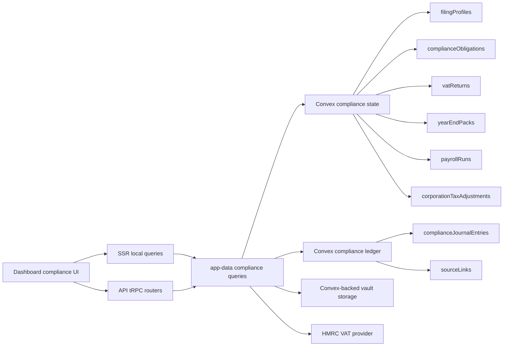

# UK Compliance Architecture

## Overview

Tamias's UK compliance area is now a shared ledger-backed workflow with three active surfaces:

- VAT filing and evidence packs
- Year-end packs with corporation-tax prep, CT rate-input schedules, CT600A close-company loans schedules, draft statutory accounts review export, filing-ready CT600/iXBRL generation for the supported small-company path, HMRC CT Transaction Engine submit/poll support with runtime-selectable test/production mode, and Companies House annual-accounts XML submit/poll support
- Payroll import/export with PAYE liability summaries

Payroll remains import/export-first. For Companies House, Tamias now has a split model: the OAuth/API app covers the public-register and supported API-filing workflows, while annual accounts filing runs through the Companies House XML gateway from the year-end workspace. HMRC corporation tax now supports a constrained filing-ready path: Tamias can assemble a CT600 XML package with a computed IRmark, fully tagged iXBRL accounts and computations for the supported small-company path, include CT600A close-company loans data when present, calculate small profits rate and marginal relief from saved CT rate inputs, submit that package to the HMRC CT Transaction Engine from the year-end workspace, and poll Transaction Engine responses. The runtime defaults to `test` and only targets `production` when `HMRC_CT_ENVIRONMENT=production` is set with live sender credentials and a real company UTR. Other complex CT schedules and non-small-company reporting regimes remain outside the supported path.

## Scope and Boundaries

### In Scope

- GB-gated UK Ltd filing profile
- HMRC VAT connection, VAT obligations, draft rebuild, submission, and evidence packs
- Internal annual obligations for `accounts` and `corporation_tax`
- Year-end pack rebuilds from the shared compliance journal
- Manual year-end journals stored as first-class journal entries
- Corporation-tax adjustment schedules inside the year-end pack
- Corporation-tax rate-input schedules inside the year-end pack
- CT600A close-company loans schedules inside the year-end pack
- Draft statutory accounts HTML/JSON generation inside the year-end export bundle for review and handoff
- Filing-ready CT600 XML/JSON generation for the supported small-company path
- Computed IRmark and encoded iXBRL account/computation payloads inside the CT600 XML export
- Filing-ready iXBRL account/computation attachment generation for the supported small-company path
- Companies House XML-gateway annual-accounts submission XML generation for the supported small-company path
- Companies House annual-accounts submit/poll actions in the year-end workspace
- HMRC CT transaction-engine submit/poll helper provider
- Year-end workspace actions for CT Transaction Engine submission and response polling, defaulting to test mode
- Parsed HMRC CT submission outcomes plus a stored vault bundle of the exact CT600/iXBRL payload sent for each submission
- Payroll CSV/manual import into the shared compliance journal
- Payroll export bundles and PAYE liability summaries

### Explicitly Out of Scope

- Filing-ready statutory accounts generation outside the supported small-company path
- Supplementary CT schedules other than CT600A and complex relief regimes outside the supported path
- Loss-making or otherwise unsupported CT computation paths
- HMRC sender-credential provisioning, recognition administration, or other onboarding work outside the app runtime
- Native payroll calculation engine
- RTI or PAYE Online submission
- Payroll provider integrations beyond CSV/manual import

## Architecture

## Main Data Model

### Shared Models

- `filingProfiles`
  - Canonical UK filing profile for VAT, year-end, and payroll
  - Stores legal entity settings, year-end date, base currency, filing mode, tax IDs, and the Companies House company authentication code
- `complianceObligations`
  - Shared obligation store
  - Includes HMRC VAT obligations plus internally generated `accounts` and `corporation_tax` obligations
- `complianceJournalEntries`
  - Shared compliance ledger input
  - Contains derived VAT journals plus manual year-end journals and payroll-import journals
- `sourceLinks`
  - Source-to-journal mapping
  - Supports `transaction`, `invoice`, `invoice_refund`, `manual_adjustment`, and `payroll_import`

### VAT-Specific Models

- `vatReturns`
- `complianceAdjustments`
- `evidencePacks`
- `submissionEvents`

### Year-End Models

- `yearEndPacks`
  - Keyed by `teamId + filingProfileId + periodKey`
  - Stores trial balance, P&L, balance sheet, retained earnings, working papers, CT summary, and export metadata
- `corporationTaxAdjustments`
  - Manual CT prep adjustments scoped to a year-end period
- `corporationTaxRateSchedules`
  - Manual CT rate-input schedules scoped to a year-end period
  - Stores qualifying exempt distributions plus associated-companies counts for the whole period or split across two financial years
- `closeCompanyLoansSchedules`
  - Manual CT600A schedules scoped to a year-end period
  - Stores Part 1, Part 2, and Part 3 loans to participators data plus the outstanding-loans total

### Payroll Models

- `payrollRuns`
  - Keyed by team and pay period
  - Stores import checksum, journal reference, liability totals, and export metadata

## Query Surface

### VAT

- `packages/app-data/src/queries/compliance.ts`
- `apps/api/src/trpc/routers/vat.ts`

### Year-End

- `packages/app-data/src/queries/year-end.ts`
- `apps/api/src/trpc/routers/year-end.ts`

Main operations:

- `getYearEndDashboard`
- `getYearEndPack`
- `rebuildYearEndPack`
- `upsertYearEndManualJournal`
- `deleteYearEndManualJournal`
- `upsertCorporationTaxAdjustment`
- `deleteCorporationTaxAdjustment`
- `upsertCorporationTaxRateSchedule`
- `deleteCorporationTaxRateSchedule`
- `generateYearEndExport`

### Payroll

- `packages/app-data/src/queries/payroll.ts`
- `apps/api/src/trpc/routers/payroll.ts`

Main operations:

- `getPayrollDashboard`
- `listPayrollRuns`
- `importPayrollRun`
- `generatePayrollExport`

## Year-End Pack Contents

Each year-end pack rebuild includes:

- Balanced trial balance
- Profit and loss summary
- Balance sheet summary
- Retained earnings roll-forward
- Working-paper sections for:
  - bank
  - receivables
  - payables
  - VAT
  - debt
  - equity
  - tax accruals
- Corporation-tax prep schedule for:
  - accounting profit before tax
  - manual tax adjustments
  - taxable profit
  - estimated corporation tax due
  - gross corporation tax and marginal relief where applicable

## Export Bundles

### Year-End

The current year-end export bundle contains:

- `trial-balance.csv`
- `working-papers.csv`
- `ct-summary.csv`
- `statutory-accounts-draft.html`
- `statutory-accounts-draft.json`
- `ct600-draft.xml`
- `ct600-draft.json`
- `accounts-attachment.ixbrl.xhtml`
- `computations-attachment.ixbrl.xhtml`
- `companies-house-accounts-submission.xml` when the Companies House XML presenter runtime is configured
- `corporation-tax-rate-inputs.json` when CT rate inputs are saved for the period
- `ct600a-close-company-loans.json` when a CT600A schedule is saved for the period
- `manifest.json`
- zip bundle stored in the vault

### Payroll

The current payroll export bundle contains:

- `payroll-runs.csv`
- `payroll-journals.csv`
- `liability-summary.csv`
- `manifest.json`
- zip bundle stored in the vault

## Frontend Surfaces

- `apps/dashboard/src/components/compliance/vat-dashboard.tsx`
- `apps/dashboard/src/components/compliance/year-end-dashboard.tsx`
- `apps/dashboard/src/components/compliance/payroll-dashboard.tsx`

Routes:

- `/compliance/vat`
- `/compliance/settings`
- `/compliance/year-end`
- `/compliance/payroll`

## Verification

Current automated verification added with this implementation:

- VAT box unit tests in `packages/app-data/src/queries/compliance.test.ts`
- Year-end helper tests in `packages/app-data/src/queries/year-end.test.ts`
- Payroll helper tests in `packages/app-data/src/queries/payroll.test.ts`
- Typecheck passes for `packages/app-data` and `apps/api`
